# Tournament V2 — Data Model (Draft)

**สถานะ**: Draft SQL เพื่อการออกแบบเท่านั้น **ยังไม่ได้รัน และห้ามรันจนกว่าจะอนุมัติ** — Sync แล้วกับ Final Decisions จาก `TOURNAMENT_V2_DECISION_CHECKLIST.md` (2026-07-14) จุดที่มีคำว่า **DECISION LOCKED** คือคำตอบสุดท้ายจากเจ้าของระบบ
**ฐาน**: Candidate table list จาก `TOURNAMENT_V2_PREPARATION_PLAN.md` Section 6, ปรับตามข้อพิจารณา 17 ข้อในเอกสารเดียวกัน
**อ้างอิงปัญหาที่ต้องแก้จาก V1**: ดู `TOURNAMENT_V2_CURRENT_STATE_AUDIT.md` โดยเฉพาะ R1 (goals/cards เข้าไม่ถึง tournament match), R3 (tiebreak ไม่ครบ), TD-5 (bracket ไม่รองรับ custom round/bye), R7 (ไม่มี RBAC ระดับ Venue), R8 (ไม่มี Placeholder/Draw ใน V1)
**ปรับปรุงตาม v1.1**: เพิ่มตาราง Venue/Court/RBAC/Result-Workflow (หมวด 2.17-2.22) เพื่อรองรับ 7 ประเภทการแข่งขัน กระจายลง 4 สนามพร้อมกัน — ดูสถาปัตยกรรมเต็มใน `TOURNAMENT_V2_TARGET_ARCHITECTURE.md` หมวด 11 และ `TOURNAMENT_V2_VENUE_OPERATIONS.md`
**ปรับปรุงตาม Scheduling Addendum (รอบนี้)**: เพิ่ม Placeholder/Source Definition บน `tournament_matches` โดยตรง, เพิ่มตาราง Draw/Schedule-Import (หมวด 2.7b, 2.21), และ **ปรับโครงสร้าง `tournament_bracket_matches` ใหม่ทั้งหมด** (ดูเหตุผลหมวด 2.15 — ยุบรวมเข้ากับ `tournament_matches` เพราะข้อมูลซ้ำซ้อนกันเมื่อทุก Match รองรับ Source Definition ได้อยู่แล้ว) รายละเอียดเต็มอยู่ใน `TOURNAMENT_V2_SCHEDULING_AND_IMPORT.md`

---

## 1. ERD (Mermaid)

```mermaid
erDiagram
    tournaments ||--o{ tournament_categories : has
    tournaments ||--o{ tournament_venues : has
    tournaments ||--o{ tournament_audit_logs : logs

    tournament_categories ||--o{ tournament_teams : has
    tournament_categories ||--o{ tournament_groups : has
    tournament_categories ||--o{ tournament_knockout_rounds : has
    tournament_categories ||--o{ tournament_standing_rules : configures
    tournament_categories ||--o{ tournament_qualification_rules : configures
    tournament_categories ||--o{ tournament_category_venues : "assigned to"
    tournament_venues ||--o{ tournament_category_venues : hosts
    tournament_venues ||--o{ tournament_courts : has

    tournament_teams ||--o{ tournament_players : rosters
    tournament_teams ||--o{ tournament_staff : rosters
    tournament_teams ||--o{ tournament_group_members : "resolved into (nullable)"

    tournament_groups ||--o{ tournament_group_members : "slots (pre/post draw)"
    tournament_group_members ||--o{ tournament_draw_assignments : "resolution history of"

    tournament_teams ||--o{ tournament_matches : "home/away (resolved)"
    tournament_venues ||--o{ tournament_matches : hosts
    tournament_courts ||--o{ tournament_matches : hosts
    tournament_groups ||--o{ tournament_matches : "group stage"
    tournament_knockout_rounds ||--o{ tournament_matches : "knockout stage (round_id)"
    tournament_matches }o--o{ tournament_matches : "home/away_source_ref → match_winner/loser (by match_code)"

    tournament_schedule_batches ||--o{ tournament_schedule_import_rows : contains
    tournament_schedule_import_rows }o--o| tournament_matches : "creates/updates"
    tournament_schedule_batches ||--o{ tournament_matches : "schedule_batch_id (provenance)"
    tournament_categories ||--o{ tournament_schedule_versions : "publish status per stage"

    tournament_matches ||--o{ tournament_match_goals : has
    tournament_matches ||--o{ tournament_match_cards : has
    tournament_matches ||--o{ tournament_match_reports : has
    tournament_matches ||--o{ tournament_match_officials : assigned
    tournament_matches ||--o{ tournament_match_attachments : has
    tournament_matches ||--o{ tournament_result_submissions : has
    tournament_matches ||--o{ tournament_suspension_serving_matches : serves

    tournament_result_submissions ||--o{ tournament_result_versions : "history of"
    tournament_result_submissions ||--o{ tournament_result_approvals : "approval actions"

    tournament_user_profiles ||--o{ tournament_role_assignments : holds
    tournament_user_profiles ||--o{ tournament_match_officials : "assigned as"
    tournament_user_profiles ||--o{ tournament_result_submissions : submits
    tournament_user_profiles ||--o{ tournament_result_approvals : acts

    tournament_match_cards }o--|| tournament_players : "committed by"
    tournament_match_goals }o--|| tournament_players : "scored by"

    tournament_players ||--o{ tournament_suspension_events : accrues
    tournament_suspension_events ||--o{ tournament_suspension_serving_matches : "served across"

    tournament_groups ||--o{ tournament_standing_overrides : "manual override"

    tournament_categories ||--o{ tournament_qualification_draws : "qualification draw per category"
    tournament_qualification_draws ||--o{ tournament_qualification_draw_candidates : "eligible teams"
    tournament_teams ||--o{ tournament_qualification_draw_candidates : "candidate/drawn"
```



> **หมายเหตุ**: `tournament_bracket_matches` ที่เคยมีในรอบก่อนหน้าถูก**ยุบรวมเข้า `tournament_matches` แล้ว** (ดูเหตุผลหมวด 2.15) — ไม่ปรากฏใน ERD นี้อีกต่อไป ความสัมพันธ์ "winner/loser ของนัดก่อนหน้าไปยังนัดถัดไป" ตอนนี้แสดงผ่าน `tournament_matches.away_source_ref`/`home_source_ref` ที่อ้าง `match_code` ของนัดต้นทางโดยตรง (self-referencing ผ่านค่า text ไม่ใช่ FK)

---

## 2. Table Definitions (Draft DDL — ยังไม่รัน)

> Convention: ทุกตาราง entity หลัก (`tournaments`, `tournament_categories`, `tournament_teams`, `tournament_players`, `tournament_matches`) มี `deleted_at TIMESTAMPTZ` สำหรับ Soft Delete; ตาราง Event/Log (`tournament_match_goals`, `tournament_match_cards`, `tournament_audit_logs`, suspension tables) เป็น **Hard Delete + Audit Log entry** เท่านั้น ไม่มี `deleted_at`

### 2.1 `tournaments`
```sql
create table tournament.tournaments (
  id uuid primary key default gen_random_uuid(),
  name text not null,
  slug text not null,
  status text not null default 'upcoming' check (status in ('upcoming','active','completed','archived')),
  start_date date,
  end_date date,
  organizer text,
  created_by uuid,
  updated_by uuid,
  created_at timestamptz not null default now(),
  updated_at timestamptz not null default now(),
  deleted_at timestamptz
);
create unique index tournaments_slug_key on tournament.tournaments (slug) where deleted_at is null;
```
**เหตุผล**: `slug` unique เฉพาะ record ที่ยังไม่ลบ (partial unique index) เพื่อให้สร้าง tournament slug ซ้ำชื่อเดิมได้หลัง soft-delete รายการเก่า — ตอบโจทย์ "Tournament หนึ่งรายการมีหลายรุ่นอายุได้" ผ่านความสัมพันธ์กับ `tournament_categories`

### 2.2 `tournament_categories` (แทนที่ `age_groups`, รองรับเพศ)
```sql
create table tournament.tournament_categories (
  id uuid primary key default gen_random_uuid(),
  tournament_id uuid not null references tournament.tournaments(id) on delete cascade,
  code text not null,                 -- e.g. U14B, U14G, U16-MIXED
  name text not null,
  gender text not null default 'mixed' check (gender in ('male','female','mixed')),
  sort_order int not null default 1,
  created_at timestamptz not null default now(),
  updated_at timestamptz not null default now(),
  deleted_at timestamptz,
  unique (tournament_id, code)
);
```
**เหตุผล**: "รองรับชายและหญิง" → `gender` เป็น field ของ category ไม่ใช่ของ team/player แยก เพื่อให้ 1 tournament รองรับ U14 ชาย + U14 หญิง เป็นคนละ category ได้ (`unique(tournament_id, code)` กันโค้ดชนกัน)

### 2.3 `tournament_venues`
```sql
create table tournament.tournament_venues (
  id uuid primary key default gen_random_uuid(),
  tournament_id uuid not null references tournament.tournaments(id) on delete cascade,
  name text not null,
  code text not null,                 -- ใหม่ Scheduling Addendum: รหัสอ้างอิงสั้นสำหรับ Excel เช่น "V1" (แยกจาก slug)
  slug text not null,                 -- v1.1: สำหรับ /tournament/venues/[venueSlug]
  address text,
  sort_order int not null default 0,   -- v1.1: ลำดับแสดงผล "สนามที่ 1-4"
  active boolean not null default true,
  created_at timestamptz not null default now(),
  updated_at timestamptz not null default now(),
  unique (tournament_id, slug),
  unique (tournament_id, code)
);
```
**เหตุผล**: "โปรแกรมแข่งขันอาจมีหลายสนาม" → แยกเป็น entity อ้างอิงได้ (V1 เก็บแค่ `venue text` freetext บน `matches` — ดู Gap Analysis ใน Current State Audit หมวด 13) `slug` จาก v1.1 เพื่อให้ Public URL กรองตามสนามได้จริง `code` เพิ่มจาก Scheduling Addendum แยกจาก `slug` โดยตั้งใจ — `slug` ต้อง URL-safe และอาจยาว (`sanam-1`) ส่วน `code` เป็นรหัสสั้นมนุษย์จำง่ายสำหรับกรอกใน Excel (`venue_code` column ตามที่ระบุใน `TOURNAMENT_V2_SCHEDULING_AND_IMPORT.md`)

### 2.3b `tournament_courts` (v1.1, เพิ่ม `code` ใน Scheduling Addendum)
```sql
create table tournament.tournament_courts (
  id uuid primary key default gen_random_uuid(),
  venue_id uuid not null references tournament.tournament_venues(id) on delete cascade,
  code text not null,                -- ใหม่ Scheduling Addendum: e.g. "C1" สำหรับ court_code ใน Excel
  name text not null,               -- e.g. "คอร์ต A", "คอร์ต B"
  sort_order int not null default 0,
  active boolean not null default true,
  created_at timestamptz not null default now(),
  unique (venue_id, code)
);
```
**เหตุผล**: v1.1 ระบุว่าสนามเดียวกันอาจบันทึกผลได้มากกว่าหนึ่งคอร์ตพร้อมกัน — แยก entity ออกจาก `tournament_venues` เพื่อให้นับ Progress/Concurrency ระดับคอร์ตได้ ไม่ปนกับระดับสนาม `code` เพิ่มจาก Scheduling Addendum เพื่อให้ Excel อ้างอิง `court_code` ได้โดยไม่ต้องรู้ UUID

### 2.3c `tournament_category_venues` (ใหม่ v1.1 — แทนที่การ Hardcode Mapping)
```sql
create table tournament.tournament_category_venues (
  id uuid primary key default gen_random_uuid(),
  category_id uuid not null references tournament.tournament_categories(id) on delete cascade,
  venue_id uuid not null references tournament.tournament_venues(id) on delete cascade,
  is_primary boolean not null default true,
  created_at timestamptz not null default now(),
  unique (category_id, venue_id)
);
```
**เหตุผล**: ตอบข้อกำหนด v1.1 โดยตรง — "ข้อมูลการจับคู่สนาม/Category ต้องเก็บเป็น Configuration ใน Database ห้าม Hardcode" `is_primary` เผื่อกรณีมีนัดพิเศษย้ายไปแข่งที่สนามสำรอง (many-to-many ไม่ใช่ 1:1) ตัวอย่างข้อมูลเริ่มต้นตาม mapping จริง:

```text
(B-U12, สนามที่ 1, is_primary=true)
(G-U14, สนามที่ 1, is_primary=true)
(B-U14, สนามที่ 2, is_primary=true)
(G-U16, สนามที่ 2, is_primary=true)
(B-U16, สนามที่ 3, is_primary=true)
(G-U18, สนามที่ 3, is_primary=true)
(B-U18, สนามที่ 4, is_primary=true)
```

### 2.4 `tournament_teams`
```sql
create table tournament.tournament_teams (
  id uuid primary key default gen_random_uuid(),
  tournament_id uuid not null references tournament.tournaments(id) on delete cascade,
  category_id uuid not null references tournament.tournament_categories(id) on delete cascade,
  school_name text,                    -- ไม่ FK ไป master ภายนอก — DECISION LOCKED (D-04, 2026-07-14): Tournament Team Data แยกอิสระ ไม่มี School/Team Master ร่วมกับ League ใน MVP, school_name ซ้ำกันข้าม category ได้
  name text not null,
  short_name text,
  team_code text not null,
  logo_url text,
  active boolean not null default true,
  created_by uuid,
  created_at timestamptz not null default now(),
  updated_at timestamptz not null default now(),
  deleted_at timestamptz,
  unique (category_id, team_code)
);
create index idx_tteams_category on tournament.tournament_teams (category_id) where deleted_at is null;
```
**เหตุผล**: `unique(category_id, team_code)` ตรงตาม "Team Code ต้องไม่ชนกันภายใน Tournament Category" — **ไม่** unique ข้าม category ทั้ง tournament เพื่อให้ "ทีมโรงเรียนเดียวกันอาจลงหลายรุ่น" ทำได้ (โรงเรียนเดียวกันสมัคร U14 และ U16 เป็นคนละ `tournament_teams` row, คนละ `team_code` ก็ได้)

**DECISION LOCKED (D-04, 2026-07-14)**: ไม่สร้าง `school_master` ใน MVP — Import ทีมใหม่แยกอิสระต่อ Tournament ทุกครั้ง ไม่มี FK ไปยัง League `teams` โดยเด็ดขาด สามารถเพิ่ม `school_master` เป็น Future Enhancement ได้โดยไม่เปลี่ยน Match History เดิม

### 2.5 `tournament_players`
```sql
create table tournament.tournament_players (
  id uuid primary key default gen_random_uuid(),
  tournament_id uuid not null references tournament.tournaments(id) on delete cascade,
  category_id uuid not null references tournament.tournament_categories(id) on delete cascade,
  team_id uuid not null references tournament.tournament_teams(id) on delete cascade,
  player_code text not null,
  full_name text not null,
  birth_date date,
  shirt_no int,
  active boolean not null default true,
  created_at timestamptz not null default now(),
  updated_at timestamptz not null default now(),
  deleted_at timestamptz,
  unique (tournament_id, player_code),
  unique (team_id, shirt_no)
);
```
**เหตุผล**: "นักกีฬาอาจมี Shirt Number แยกตามรายการ" → `unique(team_id, shirt_no)` แทนที่จะ unique ข้าม tournament ทั้งหมด — นักกีฬาคนเดียวกันที่ลงสองทีม (สองรุ่นอายุ) จะมีสอง `tournament_players` row คนละ `team_id`, คนละเบอร์ได้

**DECISION LOCKED (D-05, 2026-07-14)**: **ไม่สร้าง `person_id` กลางใน MVP** — ไม่เชื่อมนักกีฬาข้าม Tournament หรือข้าม Category, Discipline/Suspension ไม่สะสมข้าม Tournament และไม่สะสมข้าม Category, ไม่ใช้เลขบัตรประชาชนเป็น Global Identity, ห้าม Join หรือ Sync กับ League `players` โดยเด็ดขาด

### 2.6 `tournament_staff`
```sql
create table tournament.tournament_staff (
  id uuid primary key default gen_random_uuid(),
  tournament_id uuid not null references tournament.tournaments(id) on delete cascade,
  team_id uuid not null references tournament.tournament_teams(id) on delete cascade,
  full_name text not null,
  role text not null default 'coach',
  phone text,
  active boolean not null default true,
  created_at timestamptz not null default now(),
  updated_at timestamptz not null default now()
);
```

### 2.7 `tournament_groups` / `tournament_group_members` (ปรับใน Scheduling Addendum — รองรับ Group Slot ก่อนจับฉลาก)
```sql
create table tournament.tournament_groups (
  id uuid primary key default gen_random_uuid(),
  tournament_id uuid not null references tournament.tournaments(id) on delete cascade,
  category_id uuid not null references tournament.tournament_categories(id) on delete cascade,
  name text not null,
  code text not null,                 -- เปลี่ยนจาก nullable เป็น NOT NULL ใน Scheduling Addendum: จำเป็นสำหรับ group_code ใน Excel (เช่น "A")
  sort_order int not null default 0,
  created_at timestamptz not null default now(),
  updated_at timestamptz not null default now(),
  unique (category_id, code)          -- ใหม่: กัน group code ชนกันภายใน category เดียวกัน
);
create index idx_tgroups_category on tournament.tournament_groups (category_id, sort_order);

create table tournament.tournament_group_members (
  id uuid primary key default gen_random_uuid(),
  group_id uuid not null references tournament.tournament_groups(id) on delete cascade,
  slot_code text not null,             -- ใหม่ Scheduling Addendum: e.g. "A-S1" — ตำแหน่งในกลุ่มก่อนจับฉลาก
  team_id uuid references tournament.tournament_teams(id) on delete set null,  -- เปลี่ยนจาก NOT NULL เป็น nullable: ว่างได้ก่อนจับฉลาก
  sort_order int not null default 0,
  draw_order int,                      -- ใหม่ QA fix: ลำดับที่ทีมนี้ถูกจับฉลากออกมา (cache จาก tournament_draw_assignments.draw_order ล่าสุด)
  assignment_version int not null default 1,  -- ใหม่ QA fix: cache ของ tournament_draw_assignments.version ล่าสุด — ใช้ optimistic-lock ตอน Re-resolve ด้วย
  resolved_at timestamptz,             -- ใหม่: เวลาที่ทีมจริงถูก resolve ลง slot นี้ (null = ยังไม่จับฉลาก)
  resolved_by uuid,                    -- ใหม่: ผู้ทำการจับฉลาก/กรอก Mapping
  created_at timestamptz not null default now(),
  updated_at timestamptz not null default now(),
  unique (group_id, slot_code),
  unique (group_id, team_id)
);
create index idx_tgroupmembers_team on tournament.tournament_group_members (team_id) where team_id is not null;
```
**เหตุผล**: "รองรับกลุ่มที่จำนวนทีมไม่เท่ากัน" → ไม่มี constraint จำกัดจำนวนสมาชิกต่อกลุ่ม, จำนวนทีมต่อกลุ่มเป็น business rule ระดับ Admin UI ไม่ใช่ DB constraint

**การเปลี่ยนแปลงใน Scheduling Addendum**: เดิม `tournament_group_members` ผูก `team_id` แบบ `NOT NULL` เสมอ (สมมติว่ารู้ทีมตั้งแต่สร้างกลุ่ม) — ข้อกำหนดใหม่ต้องการให้ **สร้างตำแหน่งในกลุ่ม (Group Slot เช่น `A-S1`, `A-S2`) ได้ก่อนรู้ว่าทีมไหนอยู่ตำแหน่งไหน** (เพื่อ Generate โปรแกรมแข่งขันรอบแบ่งกลุ่มล่วงหน้าได้ก่อนจับฉลากจริง) จึงต้อง:
1. เพิ่ม `slot_code` เป็นตัวระบุตำแหน่งที่คงอยู่ถาวรไม่ว่าจะจับฉลากแล้วหรือยัง (`unique(group_id, slot_code)`)
2. เปลี่ยน `team_id` เป็น nullable — แถวนี้แทน "ตำแหน่งในกลุ่ม" ไม่ใช่แค่ "สมาชิกที่ resolve แล้ว" — เมื่อจับฉลากเสร็จ `team_id`/`resolved_at`/`resolved_by` จะถูกเติมเข้ามา
3. **`tournament_group_slots` ที่เคยเสนอเป็น candidate table แยก จึงไม่จำเป็นต้องมีจริง — ยุบรวมเข้ากับ `tournament_group_members` โดยตรง** (entity เดียวกัน แค่คนละช่วงเวลาของ Lifecycle) รายละเอียดเหตุผลเต็มอยู่ใน `TOURNAMENT_V2_SCHEDULING_AND_IMPORT.md` หมวด 11

**เพิ่มจาก QA Pass (รอบนี้)**: `draw_order` และ `assignment_version` เป็น **Denormalized Cache** ของค่าล่าสุดจาก `tournament_draw_assignments` (ตาราง Append-only History ในหมวด 2.8b) — Pattern เดียวกับ `team_id`/`resolved_at`/`resolved_by` ที่มีอยู่แล้ว: `tournament_draw_assignments` คือแหล่งความจริงที่มีประวัติครบทุก Version, ส่วนค่าบน `tournament_group_members` คือค่าล่าสุดที่ query ได้เร็วโดยไม่ต้อง `ORDER BY version DESC LIMIT 1` ทุกครั้ง — `assignment_version` ยังใช้เป็น Optimistic Lock ตอน Re-resolve ได้ด้วย (ถ้า Client ส่ง version เก่ากว่าที่ DB มีตอนพยายามแก้ Draw ให้ reject)

### 2.8 `tournament_matches` (แกนกลาง — แก้ปัญหา R1/TD-5/R8 จาก V1)
```sql
create table tournament.tournament_matches (
  id uuid primary key default gen_random_uuid(),
  tournament_id uuid not null references tournament.tournaments(id) on delete cascade,
  category_id uuid not null references tournament.tournament_categories(id) on delete cascade,
  group_id uuid references tournament.tournament_groups(id) on delete set null,
  round_id uuid references tournament.tournament_knockout_rounds(id) on delete set null,  -- ใหม่ Scheduling Addendum: แทนที่ tournament_bracket_matches (ดูหมวด 2.15)
  stage text not null default 'group'
    check (stage in ('group','round_of_32','round_of_16','quarter_final','semi_final','third_place','final','custom')),
  match_code text not null,
  match_no int,                          -- ลำดับที่ประกาศ อาจไม่ตรงกับลำดับจริงในรอบ — ใช้จัดเรียงตำแหน่งในสาย/รอบด้วย (แทน bracket_position เดิม)
  matchday text,
  match_date date,
  match_time text,
  venue_id uuid references tournament.tournament_venues(id) on delete set null,
  court_id uuid references tournament.tournament_courts(id) on delete set null,   -- v1.1: รองรับหลาย Court ต่อสนาม
  home_team_id uuid references tournament.tournament_teams(id) on delete set null,
  away_team_id uuid references tournament.tournament_teams(id) on delete set null,
  home_source_type text                    -- ใหม่ Scheduling Addendum: ที่มาของทีมฝั่ง Home ก่อน Resolve
    check (home_source_type in ('team','group_slot','group_rank','match_winner','match_loser','best_ranked','draw_selected','bye','tbd')),
  home_source_ref text,                     -- ใหม่: ค่าอ้างอิงตาม source_type เช่น 'A-S1' / 'A:1' / 'B-U12-R16-01' / 'third_place:1' / 'G-U16-THIRD-DRAW-1'
  away_source_type text
    check (away_source_type in ('team','group_slot','group_rank','match_winner','match_loser','best_ranked','draw_selected','bye','tbd')),
  away_source_ref text,                     -- ใหม่
  sources_resolved_at timestamptz,          -- ใหม่: เวลาที่ home/away_team_id ถูกเติมจาก source_ref ล่าสุด (null = ยังไม่ resolve หรือยังเป็น TBD)
  regulation_home_score int,                -- DECISION LOCKED (D-09, 2026-07-14): แยกจากคะแนนจุดโทษชัดเจน (เดิมชื่อ home_score ซึ่งกำกวมว่ารวม Penalty หรือไม่)
  regulation_away_score int,
  penalty_home_score int,                   -- DECISION LOCKED (D-09): เดิมชื่อ home_penalty_score — เปลี่ยนชื่อให้ตรงกับคำตัดสิน
  penalty_away_score int,
  decided_by text                           -- DECISION LOCKED (D-09): 'regulation' | 'penalty' — ระบุว่าผลตัดสินจบที่เวลาปกติหรือต้องยิงจุดโทษ
    check (decided_by in ('regulation','penalty')),
  winner_team_id uuid references tournament.tournament_teams(id) on delete set null,
  status text not null default 'scheduled'
    check (status in ('scheduled','ready','in_progress','finished','postponed','cancelled','abandoned','bye','void')),
  result_workflow_status text not null default 'not_started'                      -- DECISION LOCKED (D-16, 2026-07-14): Single-step with Mandatory Preview — เอา approved/rejected ออก (ไม่มีผู้อนุมัติคนที่สองในกระบวนการปกติ) เพิ่ม previewed
    check (result_workflow_status in
      ('not_started','draft','previewed','submitted','published','correction_requested','corrected')),
  schedule_status text not null default 'draft'                                   -- ใหม่ QA fix: cache ของ tournament_schedule_versions.status ที่ (category_id, stage) นี้สังกัดอยู่
    check (schedule_status in ('draft','validated','published','revision_required','archived')),
    -- DECISION LOCKED (D-28, 2026-07-15): published -> revision_required ต้องมีคนกดยืนยันเสมอ
    -- (tournament_super_admin เท่านั้น) — ห้าม Auto-downgrade จาก Import โดยไม่มี Confirmation
    -- แยกต่างหาก ดู TOURNAMENT_V2_SCHEDULING_AND_IMPORT.md หมวด 8.1
  result_policy text not null default 'single_step'                              -- DECISION LOCKED (D-16, 2026-07-14): Default เป็น single_step ทุกนัด ไม่มี Stage-based Variation ในคำตัดสินนี้ — Column คงไว้เผื่อยืดหยุ่นอนาคต ค่า two_step/central_review ยังไม่ถูกใช้จริงในรอบนี้
    check (result_policy in ('single_step','two_step','central_review')),
  result_type text not null default 'normal'
    check (result_type in ('normal','bye','walkover','penalty_decided')),
  note text,
  schedule_batch_id uuid,                   -- ใหม่ Scheduling Addendum: FK ไป tournament_schedule_batches (ประกาศ FK จริงหลังตารางนั้นถูกสร้าง — ดูหมวด 2.21)
  version int not null default 1,           -- ใหม่ QA fix: Optimistic Lock สำหรับแก้ไขระดับ Schedule/Source (แยกจาก tournament_result_submissions.version ที่ล็อกเฉพาะข้อมูลผลการแข่งขัน)
  created_by uuid,
  updated_by uuid,
  created_at timestamptz not null default now(),
  updated_at timestamptz not null default now(),
  deleted_at timestamptz,
  unique (tournament_id, match_code),
  check (home_team_id is not null or away_team_id is not null or status in ('scheduled','postponed','cancelled')),
  check (status <> 'finished' or winner_team_id is not null)     -- DECISION LOCKED (D-09, 2026-07-14): ไม่มีผลเสมออีกต่อไป — นัดที่ finished ต้องมีผู้ชนะเสมอ (ตัดสินด้วย Penalty ถ้าเสมอในเวลาปกติ)
);
create index idx_tmatches_category_stage on tournament.tournament_matches (category_id, stage);
create index idx_tmatches_group on tournament.tournament_matches (group_id);
create index idx_tmatches_round on tournament.tournament_matches (round_id);
create index idx_tmatches_date on tournament.tournament_matches (match_date);
create index idx_tmatches_home_source on tournament.tournament_matches (home_source_type, home_source_ref) where home_team_id is null;
create index idx_tmatches_away_source on tournament.tournament_matches (away_source_type, away_source_ref) where away_team_id is null;
```
**เหตุผลของแต่ละจุดที่ V1 ไม่มี**:
- `home_team_id`/`away_team_id` เป็น **nullable** → รองรับ "Bye" แบบมี match row จริง ต่างจาก V1 ที่ `home_team_id`/`away_team_id` เป็น `NOT NULL` เสมอ (`scripts/schema.sql:82-83`) — **ปรับ `check` constraint ใน Scheduling Addendum**: เดิมบังคับต้องมีทีมอย่างน้อยหนึ่งฝั่งเสมอ แต่ตอนนี้นัดที่วางตารางไว้ล่วงหน้าด้วย Placeholder (เช่น `group_slot`/`match_winner`) อาจไม่มีทีมทั้งสองฝั่งเลยตอนสร้าง (สถานะ `scheduled` เท่านั้นที่ยอมให้ทั้งคู่เป็น `null` ได้ — ทันทีที่ resolve หรือแข่งจริงต้องมีอย่างน้อยฝั่งหนึ่ง)
- `penalty_home_score`/`penalty_away_score` แยกจาก `regulation_home_score`/`regulation_away_score` → รองรับ "ผู้ชนะจากจุดโทษ" ได้ตรงไปตรงมา — **DECISION LOCKED (D-09, 2026-07-14)**: Tournament นี้ไม่มีผลเสมอเลยในตารางคะแนน (ต่างจาก FIFA 3/1/0 ที่มีผลเสมอ) เวลาแข่งขันปกติ 40 นาที เสมอแล้วต้องยิงจุดโทษตัดสินทุกนัด รวมถึงรอบแบ่งกลุ่ม — `decided_by` ระบุว่าผลจบที่ `regulation` หรือ `penalty`, ประตูจาก Penalty Shootout **ไม่นำไปรวม** `goals_for`/`goals_against`/`goal_difference`/Top Scorer (คำนวณจาก `tournament_match_goals` เท่านั้นซึ่งไม่บันทึกประตู Penalty Shootout)
- `status` มี `'bye'` และ `'void'` เพิ่มจาก V1 (V1 มีแค่ `scheduled/finished/postponed/cancelled`, `scripts/schema.sql:86`)
- `stage` มี `'round_of_32'` และ `'custom'` เพิ่มจาก V1 (V1 จำกัดที่ 4/8/16 เท่านั้น, `lib/bracket.ts:6`)
- ไม่มี `division_id` เลยในตารางนี้ (V1 ยังมี `division_id` nullable ค้างอยู่บน `matches` แม้ Tournament ไม่ใช้ — เป็นต้นเหตุของ R1)
- **`status` / `result_workflow_status` / Schedule Status (ระดับ `tournament_schedule_versions`) เป็น 3 มิติแยกกันโดยตั้งใจ**: `status` = แข่งแล้วหรือยัง, `result_workflow_status` = ผลอนุมัติ/เผยแพร่แล้วหรือยัง, Schedule Status = ตารางแข่ง/คู่แข่งขันเองถูก Publish ให้สาธารณะเห็นหรือยัง (ดู `TOURNAMENT_V2_SCHEDULING_AND_IMPORT.md` หมวด 8)
- `court_id` แยกจาก `venue_id` เพื่อรองรับ "สนามเดียวกันมีมากกว่า 1 สนามแข่งย่อย (Court)"
- **`home_source_type`/`home_source_ref`/`away_source_type`/`away_source_ref` (ใหม่ Scheduling Addendum)**: เก็บ "ที่มา" ของทีมแต่ละฝั่งแบบ Human-readable (`match_code`/`slot_code` ไม่ใช่ UUID) ตรงตามข้อกำหนด "ห้ามลบ Source Definition หลัง Resolve" — แม้ `home_team_id` ถูกเติมค่าแล้ว `home_source_type`/`home_source_ref` ยังคงอยู่ถาวรเพื่อสืบย้อนได้เสมอว่า "ทีมนี้มาจากไหน" (เช่น มาจาก Group A อันดับ 1 หรือมาจากผู้ชนะนัด R16-01) `sources_resolved_at` ใช้แยกว่า field นี้เพิ่งถูก resolve ครั้งล่าสุดเมื่อไร สำหรับ Re-resolve และ Correction Workflow
- **ทั้ง 8 ค่าของ `source_type` ตรงตามที่กำหนดไว้ในบริบทจริง**: `team` (ทีมจริงกำหนดตรงๆ, เดิมเรียก `direct_team` ใน `tournament_bracket_matches` รอบก่อนหน้า — เปลี่ยนชื่อให้สอดคล้องกับ Excel Format ใหม่), `group_slot` (ตำแหน่งจับฉลาก เช่น `A-S1` — ก่อนจับฉลาก), `group_rank` (อันดับหลังจบกลุ่ม เช่น `A:1` — หลังแข่งจบ), `match_winner`/`match_loser` (อ้าง `match_code` ของนัดต้นทาง), `best_ranked` (ทีมอันดับดีที่สุดข้ามกลุ่ม เช่น `third_place:1`), `bye`, `tbd`
- **`result_policy` ต่อนัด**: **DECISION LOCKED (D-16, 2026-07-14)**: Default = `single_step` ทุกนัดไม่มีข้อยกเว้น (Single-step Result Submission with Mandatory Preview, ไม่มีผู้อนุมัติคนที่สอง) — ค่า `two_step`/`central_review` ยังคงอยู่ใน CHECK constraint เผื่อความยืดหยุ่นในอนาคตแต่ไม่ถูกใช้จริงในรอบนี้ (ไม่มี Stage-based Policy Variation ตามคำตัดสิน)
- **`version` (ใหม่ QA fix)**: Optimistic Lock แยกต่างหากจาก `tournament_result_submissions.version` — `tournament_matches.version` ล็อกการแก้ไข **ระดับ Schedule/Fixture** (วันที่ เวลา สนาม Court Source Definition) ในขณะที่ `tournament_result_submissions.version` ล็อกการแก้ไข **ระดับผลการแข่งขัน** (สกอร์ ประตู ใบโทษ) — สองเรื่องนี้แก้โดยคนละบทบาทกันได้ (ผู้จัดโปรแกรมแก้วันเวลา vs เจ้าหน้าที่สนามกรอกผล) จึงต้องมี Lock แยกกัน ไม่ใช้ตัวเดียวร่วมกันเพราะจะทำให้แก้ Schedule บล็อกการกรอกผลโดยไม่จำเป็น (หรือกลับกัน)
- **`schedule_status` (ใหม่ QA fix)**: Denormalized Cache ของ `tournament_schedule_versions.status` ที่ `(category_id, stage)` ของนัดนี้สังกัดอยู่ ณ เวลาล่าสุด — Pattern เดียวกับ `tournament_group_members.assignment_version` (คือ cache จากตาราง version/history แยกต่างหาก) เหตุผลที่ต้อง cache ลงมาถึงระดับ Match แทนที่จะ query `tournament_schedule_versions` ทุกครั้ง: หน้า Venue Matchday Dashboard และ Public Fixtures ต้อง Filter "แสดงเฉพาะนัดที่ Schedule Publish แล้ว" เป็น Query หลักที่ใช้บ่อยมาก — มี Column ตรงบน `tournament_matches` ให้ Index ได้เร็วกว่า Join ทุกครั้ง ตัว `tournament_schedule_versions` ยังคงเป็น Source of Truth ที่มี Audit/History ครบ ส่วนนี้เป็นแค่ Read-optimization

### 2.8b `tournament_draw_assignments` (ใหม่ Scheduling Addendum — ประวัติการจับฉลาก)
```sql
create table tournament.tournament_draw_assignments (
  id uuid primary key default gen_random_uuid(),
  category_id uuid not null references tournament.tournament_categories(id) on delete cascade,
  group_id uuid not null references tournament.tournament_groups(id) on delete cascade,
  slot_code text not null,
  team_id uuid not null references tournament.tournament_teams(id) on delete cascade,
  draw_order int,
  version int not null default 1,
  note text,
  assigned_by uuid,
  assigned_at timestamptz not null default now(),
  superseded_at timestamptz              -- ไม่ null = ถูกแทนที่ด้วย version ใหม่กว่าแล้ว (append-only, ไม่ update ทับ)
);
create index idx_tdraw_group_slot on tournament.tournament_draw_assignments (group_id, slot_code, version desc);
create index idx_tdraw_category on tournament.tournament_draw_assignments (category_id);
```
**เหตุผล**: ตอบข้อกำหนด "ต้องเก็บทั้ง Original Source, Resolved Team ID, เวลาที่ Resolve, Version ของ Draw Assignment" และ "หากมีการแก้ผลจับฉลาก ต้องมี Audit Log" — ออกแบบเป็น **Append-only History**: การจับฉลากใหม่/แก้ไขทุกครั้งสร้างแถวใหม่ (version+1) พร้อม mark แถวเก่า `superseded_at`แทนที่จะ `UPDATE` ทับ ทำให้ดูประวัติการจับฉลากทั้งหมดย้อนหลังได้ครบ (ตอบ "Version ของ Draw Assignment" ตรงตัว)

**ความสัมพันธ์กับ `tournament_group_members`**: `tournament_group_members.team_id`/`resolved_at`/`resolved_by` คือ **สถานะปัจจุบัน** (denormalized cache, query เร็วเพราะ Resolution Engine ต้องอ่านบ่อยทุกครั้งที่แสดง Match) ส่วน `tournament_draw_assignments` คือ **Log ประวัติทุกเหตุการณ์** — เมื่อ Import ไฟล์ `DRAW_ASSIGNMENTS` (ดู `TOURNAMENT_V2_SCHEDULING_AND_IMPORT.md` หมวด 4) ระบบ insert แถวใหม่ที่นี่ก่อนเสมอ แล้วค่อย upsert ค่าล่าสุดเข้า `tournament_group_members`

### 2.9 `tournament_match_goals`
```sql
create table tournament.tournament_match_goals (
  id uuid primary key default gen_random_uuid(),
  match_id uuid not null references tournament.tournament_matches(id) on delete cascade,
  player_id uuid references tournament.tournament_players(id) on delete set null,
  team_id uuid not null references tournament.tournament_teams(id),
  minute int,
  is_own_goal boolean not null default false,
  goals int not null default 1,
  note text,
  created_at timestamptz not null default now(),
  updated_at timestamptz not null default now()
);
create index idx_tgoals_match on tournament.tournament_match_goals (match_id);
```
**DECISION LOCKED (D-09, 2026-07-14)**: ตารางนี้บันทึกเฉพาะประตูในเวลาแข่งขันปกติ (Regulation Play) เท่านั้น — **ไม่บันทึกการยิงจุดโทษ (Penalty Shootout) เป็น Goal Event** เพราะไม่นับรวมใน `goals_for`/`goals_against`/Top Scorer ตามคำตัดสิน ผลจุดโทษเก็บที่ `tournament_matches.penalty_home_score`/`penalty_away_score` เท่านั้น

### 2.10 `tournament_match_cards`
```sql
create table tournament.tournament_match_cards (
  id uuid primary key default gen_random_uuid(),
  match_id uuid not null references tournament.tournament_matches(id) on delete cascade,
  player_id uuid not null references tournament.tournament_players(id) on delete cascade,
  team_id uuid not null references tournament.tournament_teams(id),
  card_type text not null check (card_type in ('yellow','red','second_yellow')),
  minute int,
  note text,
  created_at timestamptz not null default now(),
  updated_at timestamptz not null default now(),
  unique (match_id, player_id, card_type)
);
create index idx_tcards_match on tournament.tournament_match_cards (match_id);
```
**หมายเหตุ**: `unique(match_id, player_id, card_type)` ต่างจาก V1 ที่ `unique(match_id, player_id)` เฉยๆ (`scripts/schema.sql:121`) — V2 อนุญาตให้นักกีฬาคนเดียวมีทั้งใบเหลืองใบแรก (`yellow`) และใบเหลืองใบที่สอง (`second_yellow`) เป็นสอง record แยกกันในนัดเดียว ตรงกับ requirement "ใบเหลืองที่สอง" ที่ต้องแยกจาก "ใบเหลืองใบแรก"

### 2.11 `tournament_match_reports`
```sql
create table tournament.tournament_match_reports (
  id uuid primary key default gen_random_uuid(),
  match_id uuid not null references tournament.tournament_matches(id) on delete cascade,
  report text,
  submitted_by uuid,
  submitted_at timestamptz not null default now()
);
```

### 2.12 `tournament_suspension_events` / `tournament_suspension_serving_matches`

**DECISION LOCKED (D-06, 2026-07-14)**: Tournament Suspension **ไม่ใช้สูตรคะแนนสะสม 2/4/6/8 ของ League** — ใช้กติกาอ้างอิงจาก `world-cup-2026-rules-summary-th.md`: นับจำนวน/ประเภทใบ (Card-count/type based) ไม่ใช่คะแนนสะสมข้ามเกณฑ์ (Points-threshold) — Schema ด้านล่างปรับ `event_type`/เอา `points_added`/`points_total_after`/`threshold_crossed` ออกเพราะเป็น League-specific concept ที่ไม่ตรงกับกติกาที่ตัดสินใจแล้ว

```sql
create table tournament.tournament_suspension_events (
  id uuid primary key default gen_random_uuid(),
  tournament_id uuid not null references tournament.tournaments(id) on delete cascade,
  category_id uuid not null references tournament.tournament_categories(id) on delete cascade,
  player_id uuid not null references tournament.tournament_players(id) on delete cascade,
  team_id uuid not null references tournament.tournament_teams(id),
  trigger_match_id uuid references tournament.tournament_matches(id) on delete set null,
  event_type text not null check (event_type in
    ('accumulated_two_yellow','second_yellow_same_match','direct_red','manual')),  -- DECISION LOCKED (D-06): Card-count/type based, ไม่ใช่ points-threshold
  ban_matches int not null default 1,       -- DECISION LOCKED (D-06): ค่าเริ่มต้น 1 นัดตามกติกาอ้างอิง (ยกเว้น manual ที่ Admin ระบุเอง)
  status text not null default 'pending' check (status in ('pending','active','served','cancelled','appealed')),
  is_manual_override boolean not null default false,  -- Manual Additional Suspension (D-06) ใช้ flag นี้ร่วมกับ event_type='manual'
  created_by uuid,
  note text,
  created_at timestamptz not null default now(),
  updated_at timestamptz not null default now()
);
create index idx_tsusp_player on tournament.tournament_suspension_events (player_id, tournament_id);

create table tournament.tournament_suspension_serving_matches (
  id uuid primary key default gen_random_uuid(),
  suspension_event_id uuid not null references tournament.tournament_suspension_events(id) on delete cascade,
  match_id uuid not null references tournament.tournament_matches(id) on delete cascade,
  status text not null default 'pending' check (status in ('pending','served','skipped_bye','skipped_postponed','skipped_cancelled')),
  created_at timestamptz not null default now(),
  unique (suspension_event_id, match_id)
);
```
**เหตุผล**: แยก Suspension Trigger (`tournament_suspension_events`) ออกจาก Serving Match (`tournament_suspension_serving_matches`) ตรงตามข้อกำหนด Section 9 ของแผนต้นทาง ("แยก Disciplinary Score / Suspension Trigger / Serving Match / Suspension Completion ออกจากกันอย่างชัดเจน") — `status` ของ serving match รองรับ Bye/Postponed/Cancelled ตรงๆ ในระดับ schema (V1 ไม่มี field นี้ ต้อง derive จาก join กับ `matches.status` ทุกครั้งใน `lib/suspension-calc.ts::findNextMatchesForSuspension`) — **Open Sub-question (D-06, ยังไม่ตัดสินใจ)**: กรณี Bye/Postponed/Cancelled นับเป็นนัดที่ต้องพักหรือไม่ ยังไม่มีคำตอบ ห้ามเดา `status` ของ Serving Match ในสามกรณีนี้ยังใช้ Placeholder logic เดิมจนกว่าจะได้คำตอบ

**Fair-play Score — DECISION LOCKED (D-06, 2026-07-14) แยกจาก Suspension Trigger โดยเจตนา**: Fair Play เป็น**ค่าที่คำนวณ (Computed)** ไม่ใช่ Stored Column — อ่านจาก `tournament_match_cards` โดยตรงแล้วให้น้ำหนักตามกติกา (ใบเหลือง = -1, ใบแดงจากสองใบเหลือง = -3, ใบแดงโดยตรง = -4, ใบเหลืองแล้วตามด้วยใบแดงโดยตรง = -5, หักเฉพาะเหตุการณ์รุนแรงที่สุดต่อคนต่อนัด) ผ่านฟังก์ชัน `calculateFairPlayScore()` — ดู [หมวด 6](#6-rule-ใดควรอยู่ใน-database-vs-code) ไม่ต้องมีตารางหรือ Column แยกเพราะเป็น Derived Data เหมือน Goal Difference ที่ไม่ถูก Store เช่นกัน

### 2.13 `tournament_standing_rules`
```sql
create table tournament.tournament_standing_rules (
  id uuid primary key default gen_random_uuid(),
  tournament_id uuid not null references tournament.tournaments(id) on delete cascade,
  category_id uuid references tournament.tournament_categories(id) on delete cascade, -- null = ใช้กับทุก category
  points_win int not null default 3,
  points_draw int not null default 1,       -- DECISION LOCKED (D-09, 2026-07-14): UNUSED — Tournament ไม่มีผลเสมอ (ตัดสินด้วย Penalty ทุกนัดที่เสมอในเวลาปกติ) คงคอลัมน์ไว้เพื่อ Backward-compat กับ Standings Engine เดิม แต่ค่านี้จะไม่ถูกใช้จริง
  points_loss int not null default 0,
  tiebreak_order jsonb not null default
    '["points","head_to_head_points","head_to_head_goal_diff","head_to_head_goals_for","group_goal_diff","group_goals_for","fair_play","lot"]',  -- DECISION LOCKED (D-09): ลำดับตามคำตัดสิน — Head-to-head (คะแนน→GD→GF) ก่อน ตามด้วยทั้งกลุ่ม (GD→GF) แล้วจึง Fair Play และจับฉลาก ไม่มี FIFA Ranking
  fair_play_enabled boolean not null default true,   -- DECISION LOCKED (D-09): เปิดใช้เสมอตามกติกาที่ตัดสินแล้ว
  lot_enabled boolean not null default true,
  mini_table_enabled boolean not null default true,   -- DECISION LOCKED (D-09): เปิดใช้เสมอ — ถ้ามีหลายทีมเท่ากันและ Head-to-head แยกบางทีมออกได้แล้ว ต้องคำนวณ Head-to-head ใหม่เฉพาะทีมที่ยังเท่ากัน (Recursive Mini-league)
  created_at timestamptz not null default now(),
  updated_at timestamptz not null default now()
);
```
**เหตุผล**: ตอบ Section 7 ของแผนต้นทาง — เก็บ**ลำดับ**และ**เปิด/ปิด**กติกา tiebreak เป็น config ใน DB (`tiebreak_order` jsonb) แต่ **สูตรคำนวณจริงของแต่ละ tiebreak อยู่ใน Code** (`lib/tournament/standings/resolveTiebreak.ts`) — ดูเหตุผลแยก Code vs DB ใน [หมวด 6](#6-rule-ใดควรอยู่ใน-database-vs-code)

**DECISION LOCKED (D-09, 2026-07-14) — Group Ranking เมื่อคะแนนเท่ากัน**: (1) คะแนนจาก Head-to-head (2) ผลต่างประตู Head-to-head (3) ประตูได้ Head-to-head (4) ผลต่างประตูทั้งกลุ่ม (5) ประตูได้ทั้งกลุ่ม (6) Fair Play (7) จับฉลาก — ถ้ามีหลายทีมเท่ากันและ Head-to-head แยกบางทีมออกได้แล้ว ให้ **คำนวณ Head-to-head ใหม่เฉพาะทีมที่ยังเท่ากัน** (Recursive Mini-league) — **ไม่ใช้ FIFA World Ranking** เพราะทีมโรงเรียนไม่มี Ranking นี้ (ต่างจากไฟล์อ้างอิง FIFA World Cup 2026 ที่ใช้ Ranking เป็นเกณฑ์สุดท้าย)

### 2.14 `tournament_qualification_rules` / `tournament_standing_overrides`
```sql
create table tournament.tournament_qualification_rules (
  id uuid primary key default gen_random_uuid(),
  tournament_id uuid not null references tournament.tournaments(id) on delete cascade,
  category_id uuid not null references tournament.tournament_categories(id) on delete cascade,
  qualify_rank_per_group int not null default 2,
  best_third_placed_count int not null default 0,
  best_third_placed_method text not null default 'ranked'       -- ใหม่ (D-07/D-29, 2026-07-14): 'ranked' = ใช้ tiebreak คะแนน/GD/GF/Fair Play/จับฉลาก ตาม D-07, 'draw' = จับฉลากเลือกตรงจากผู้มีสิทธิ์ทั้งหมดตาม D-29 (ไม่จัดอันดับ)
    check (best_third_placed_method in ('ranked','draw')),
  cross_group_comparison boolean not null default false,
  created_at timestamptz not null default now(),
  updated_at timestamptz not null default now()
);

create table tournament.tournament_standing_overrides (
  id uuid primary key default gen_random_uuid(),
  group_id uuid not null references tournament.tournament_groups(id) on delete cascade,
  team_id uuid not null references tournament.tournament_teams(id) on delete cascade,
  override_rank int not null,
  reason text not null,
  created_by uuid not null,
  created_at timestamptz not null default now(),
  unique (group_id, team_id)
);
```
**เหตุผล**: `tournament_standing_overrides` แยกออกมาต่างหาก (V1 ไม่มีเลย) เพื่อให้ Manual Override มี **Audit Trail ในตัว** (`created_by`, `reason` บังคับกรอก) ตรงตาม requirement "รองรับ Manual Override พร้อม Audit Log" — การ compute standing จริงยัง auto-calculate ตามปกติ แต่ถ้ามี override row จะ "ชนะ" การจัดอันดับอัตโนมัติ (Engine ต้อง join ตารางนี้เป็นขั้นตอนสุดท้าย)

### 2.14b `tournament_qualification_draws` / `tournament_qualification_draw_candidates` (ใหม่ — DECISION LOCKED D-07/D-29, 2026-07-14)

> เพิ่มเข้ามาเพื่อรองรับ Category ที่ `tournament_qualification_rules.best_third_placed_method = 'draw'` (เช่น G-U16 ตาม D-29) — จับฉลากเลือกทีมที่ผ่านเข้ารอบจาก Candidate Pool แทนการจัดอันดับด้วยคะแนน/GD/GF **ห้าม Hardcode ใน Engine กลาง** (`rankBestThirdPlacedTeams()`) ต้องอ่าน Config นี้เสมอ

```sql
create table tournament.tournament_qualification_draws (
  id uuid primary key default gen_random_uuid(),
  category_id uuid not null references tournament.tournament_categories(id) on delete cascade,
  qualification_slot text not null,          -- ป้ายกำกับ Pool ที่จับฉลาก เช่น 'group_third_place'
  slots_available int not null,              -- จำนวนที่ผ่านเข้ารอบจาก Pool นี้ เช่น 2 (สำหรับ G-U16: จับ 2 จาก 3)
  version int not null default 1,
  drawn_by uuid,
  drawn_at timestamptz not null default now(),
  note text,
  superseded_at timestamptz                  -- ไม่ null = ถูกแทนที่ด้วย version ใหม่กว่าแล้ว (append-only เหมือน tournament_draw_assignments)
);
create index idx_tqualdraw_category on tournament.tournament_qualification_draws (category_id, qualification_slot, version desc);

create table tournament.tournament_qualification_draw_candidates (
  id uuid primary key default gen_random_uuid(),
  draw_id uuid not null references tournament.tournament_qualification_draws(id) on delete cascade,
  team_id uuid not null references tournament.tournament_teams(id) on delete cascade,
  group_id uuid references tournament.tournament_groups(id) on delete set null,   -- กลุ่มต้นทางของทีมนี้ (เพื่อ Audit ว่ามาจากกลุ่มไหน)
  is_selected boolean not null default false,   -- true = จับได้ ผ่านเข้ารอบ
  draw_order int,                               -- ลำดับที่จับ (ถ้ามีนัยสำคัญ)
  created_at timestamptz not null default now(),
  unique (draw_id, team_id)
);
create index idx_tqualcand_draw on tournament.tournament_qualification_draw_candidates (draw_id);
```

**เหตุผล**: ตอบข้อกำหนด D-29 ตรงตัว — ต้องเก็บ **รายชื่อทีมที่มีสิทธิ์จับฉลาก** (`tournament_qualification_draw_candidates` ทุกแถวของ `draw_id`), **ทีมที่จับได้** (`is_selected=true`), **ผู้ดำเนินการ** (`drawn_by`), **วันที่และเวลา** (`drawn_at`), **Draw Version** (`version`), **หมายเหตุ/หลักฐาน** (`note`), และ **Audit Log** (ผ่าน `tournament_audit_logs` pattern เดียวกับตารางอื่น) — ออกแบบเป็น Append-only เหมือน `tournament_draw_assignments` (หมวด 2.8b) เพื่อดูประวัติการจับฉลากซ้ำได้ครบถ้วนหากมีการจับใหม่

**ตัวอย่างข้อมูลสำหรับ G-U16 (D-29)**: `tournament_qualification_draws` 1 แถว (`qualification_slot='group_third_place'`, `slots_available=2`) + `tournament_qualification_draw_candidates` 3 แถว (ทีมอันดับ 3 ของกลุ่ม A/B/C ทั้งหมด, `is_selected` เป็น `true` สำหรับ 2 ทีมที่จับได้)

### 2.15 `tournament_knockout_rounds` (ปรับใน Scheduling Addendum — `tournament_bracket_matches` ถูกยุบรวมแล้ว)

```sql
create table tournament.tournament_knockout_rounds (
  id uuid primary key default gen_random_uuid(),
  tournament_id uuid not null references tournament.tournaments(id) on delete cascade,
  category_id uuid not null references tournament.tournament_categories(id) on delete cascade,
  name text not null,
  stage text not null,
  sort_order int not null default 0,
  created_at timestamptz not null default now(),
  updated_at timestamptz not null default now()
);
```

**⚠️ Data Model Correction จากรอบก่อนหน้า**: รอบที่แล้ว `tournament_bracket_matches` ถูกออกแบบเป็นตารางแยกที่มี `home_source_type/ref`, `away_source_type/ref`, `home_team_id`, `away_team_id`, `winner_to_bracket_match_id/slot`, `loser_to_bracket_match_id/slot`, `bracket_position`, `status`, `version`, `locked_at/by` ของตัวเอง โดย FK ไป `match_id` (ชี้ไปยัง `tournament_matches` อีกที) — เมื่อ Scheduling Addendum นี้กำหนดให้ **`tournament_matches` เก็บ Source Definition ของตัวเองได้อยู่แล้ว** (`home_source_type/ref`, `away_source_type/ref` ในหมวด 2.8) ข้อมูลใน `tournament_bracket_matches` เดิมเกือบทั้งหมดจึงซ้ำซ้อนกับ `tournament_matches`:

| Field เดิมใน `tournament_bracket_matches` | แทนที่ด้วย |
|---|---|
| `home_source_type/ref`, `away_source_type/ref` | `tournament_matches.home_source_type/ref`, `away_source_type/ref` โดยตรง |
| `home_team_id`, `away_team_id` | `tournament_matches.home_team_id`, `away_team_id` โดยตรง |
| `winner_to_bracket_match_id/slot`, `loser_to_bracket_match_id/slot` | **ไม่ต้องมี** — นัดถัดไปอ้างกลับมาเองผ่าน `home_source_type='match_winner'`, `home_source_ref='<match_code ของนัดนี้>'` (ทิศทางกลับด้าน: เดิม "นัดต้นทางชี้ไปนัดปลายทาง" ตอนนี้ "นัดปลายทางอ้างกลับไปนัดต้นทางด้วย `match_code`" — Resolution Engine ค้นหา `WHERE home_source_ref = :finishedMatchCode OR away_source_ref = :finishedMatchCode` แทน) |
| `bracket_position` | `tournament_matches.match_no` (มีอยู่แล้วตั้งแต่ก่อนหน้านี้ ใช้จัดลำดับแสดงผลในรอบได้เหมือนกัน) |
| `status` (pending/ready/scheduled/in_progress/finished/blocked/void) | `tournament_matches.status` — ค่า `pending`/`blocked` ที่เคยมีเฉพาะใน bracket_matches ตอนนี้เป็น **สถานะที่คำนวณ (derived)** จาก `status='scheduled' AND (home_team_id IS NULL OR away_team_id IS NULL)` แทนที่จะเก็บเป็น enum ซ้ำอีกชุด |
| `version`, `locked_at/by` | ย้ายไปอยู่ที่ระดับ `tournament_result_submissions.version` (ผลการแข่งขัน) แทน — ส่วน "การป้องกันเขียนทับ Source Definition ที่ Publish แล้ว" ใช้กลไกคนละชุด (ดู Correction Workflow ใน `TOURNAMENT_V2_SCHEDULING_AND_IMPORT.md` หมวด 11) |
| `round_id`, `match_id`, `category_id`, `tournament_id` | `tournament_matches.round_id` (ใหม่, FK ตรงไปยัง `tournament_knockout_rounds`), `category_id`, `tournament_id` (มีอยู่แล้ว) |

**ผลคือ**: `tournament_bracket_matches` **ไม่จำเป็นต้องมีเป็นตารางแยกอีกต่อไป** — `tournament_knockout_rounds` ยังคงอยู่เฉพาะเพื่อเก็บ "ป้ายชื่อรอบ" (Round of 16, Quarter Final, ...) และลำดับการแสดงผล ส่วนตัว Match ของรอบน็อกเอาต์ทุกนัดเป็น row ปกติใน `tournament_matches` (`stage != 'group'`, `round_id` ชี้มาที่นี่) เหมือนกับนัดรอบแบ่งกลุ่มทุกประการ — ลดความซ้ำซ้อนและจุดที่ข้อมูลสองชุดอาจไม่ตรงกัน (Data Integrity Risk ที่มีอยู่จริงในการออกแบบรอบก่อนหน้า)

### 2.16 `tournament_audit_logs`
```sql
create table tournament.tournament_audit_logs (
  id uuid primary key default gen_random_uuid(),
  tournament_id uuid references tournament.tournaments(id) on delete set null,
  admin_id uuid,
  admin_email text,
  action text not null,
  entity_type text not null,
  entity_id uuid,
  entity_label text,
  old_data jsonb,
  new_data jsonb,
  created_at timestamptz not null default now()
);
create index idx_taudit_created on tournament.tournament_audit_logs (created_at desc);
create index idx_taudit_entity on tournament.tournament_audit_logs (entity_type, action);
```
โครงเดียวกับ `admin_audit_logs` เดิม (`scripts/migration-phase4f-audit-logs.sql:5-16`) — reuse pattern ตามที่ระบุไว้ใน Target Architecture หมวด 7 (Shared Pattern ไม่ใช่ Shared Instance)

### 2.17 `tournament_user_profiles` / `tournament_role_assignments` (ใหม่ v1.1 — RBAC)
```sql
create table tournament.tournament_user_profiles (
  id uuid primary key,                 -- = auth.uid() จาก League Supabase Identity Provider (ดู Target Architecture หมวด 5)
  email text not null,
  full_name text,
  active boolean not null default true,
  created_at timestamptz not null default now(),
  updated_at timestamptz not null default now()
);

create table tournament.tournament_role_assignments (
  id uuid primary key default gen_random_uuid(),
  user_id uuid not null references tournament.tournament_user_profiles(id) on delete cascade,
  role text not null check (role in
    ('tournament_super_admin','central_control','venue_manager','result_operator','match_official','read_only')),
  tournament_id uuid references tournament.tournaments(id) on delete cascade,
  venue_id uuid references tournament.tournament_venues(id) on delete cascade,
  category_id uuid references tournament.tournament_categories(id) on delete cascade,
  match_id uuid references tournament.tournament_matches(id) on delete cascade,
  created_by uuid not null,
  created_at timestamptz not null default now()
);
create index idx_trole_user on tournament.tournament_role_assignments (user_id);
create index idx_trole_venue on tournament.tournament_role_assignments (venue_id) where venue_id is not null;
create index idx_trole_category on tournament.tournament_role_assignments (category_id) where category_id is not null;
```
**เหตุผล**: ตอบข้อกำหนด v1.1 หมวด RBAC โดยตรง — หนึ่ง row ต่อหนึ่ง Scope (ผู้ใช้คนเดียวรับได้หลาย row ถ้าดูแลหลายสนาม/Category) `tournament_id`/`venue_id`/`category_id`/`match_id` ทุกตัว **nullable และเป็นอิสระต่อกัน**: ตั้งเฉพาะ `tournament_id` = สิทธิ์ทั้งรายการ (เช่น `central_control`), ตั้ง `venue_id` เพิ่ม = จำกัดแค่สนามนั้น (`venue_manager`), ตั้ง `match_id` เพิ่ม = จำกัดแค่นัดนั้น (`match_official`) — Authorization Logic (`authorizeVenueScope()`) เป็นผู้ตีความ hierarchy นี้ ไม่ใช่ constraint ระดับ DB (ดู Target Architecture หมวด 11.3)

**DECISION LOCKED (D-03, 2026-07-14) — `result_operator`**: ต่างจาก Role อื่นในตารางนี้ — `result_operator` คือ **Dedicated Shared Tournament Result-entry Account** หนึ่ง `tournament_user_profiles` row (บัญชีเดียว ไม่ใช่รายบุคคล) ที่มี `tournament_role_assignments` row แบบตั้งเฉพาะ `tournament_id` (ไม่ตั้ง `venue_id`/`category_id`/`match_id` ตายตัว เพราะเลือก Venue/Match ได้เองในแอปทุก Session) — Non-repudiation ชดเชยด้วย Audit Log ที่บันทึก `session_id`/`venue_id`/`match_id`/`device metadata`/`before-after data` ทุก Mutation (ดู Target Architecture หมวด 5)

### 2.18 `tournament_match_officials` (ใหม่ v1.1)
```sql
create table tournament.tournament_match_officials (
  id uuid primary key default gen_random_uuid(),
  match_id uuid not null references tournament.tournament_matches(id) on delete cascade,
  user_id uuid not null references tournament.tournament_user_profiles(id) on delete cascade,
  role_note text,
  created_at timestamptz not null default now(),
  unique (match_id, user_id)
);
```
**เหตุผล**: มอบหมาย `match_official` เฉพาะนัดได้ตรงตัว แยกจาก `tournament_role_assignments.match_id` general-purpose record เพื่อให้ query "ใครเป็นกรรมการนัดนี้" ทำได้ตรงไปตรงมาโดยไม่ต้อง filter role type ปนกัน

### 2.19 `tournament_match_attachments` (ใหม่ v1.1)
```sql
create table tournament.tournament_match_attachments (
  id uuid primary key default gen_random_uuid(),
  match_id uuid not null references tournament.tournament_matches(id) on delete cascade,
  report_id uuid references tournament.tournament_match_reports(id) on delete set null,
  file_url text not null,
  file_type text not null default 'image' check (file_type in ('image','document')),
  uploaded_by uuid references tournament.tournament_user_profiles(id) on delete set null,
  uploaded_at timestamptz not null default now()
);
create index idx_tattach_match on tournament.tournament_match_attachments (match_id);
```
**เหตุผล**: v1.1 Full Match Report ต้องการ "แนบเอกสารหรือภาพถ่ายเพิ่มเติม" — เก็บ URL เท่านั้น (ไฟล์จริงอยู่บน Object Storage/Supabase Storage แยกต่างหาก, ไม่ผูก schema กับ storage provider เฉพาะเจาะจง)

### 2.20 `tournament_result_submissions` / `tournament_result_versions` / `tournament_result_approvals` (ใหม่ v1.1 — แกนของ Result Workflow)
```sql
create table tournament.tournament_result_submissions (
  id uuid primary key default gen_random_uuid(),
  match_id uuid not null references tournament.tournament_matches(id) on delete cascade,
  stage text not null check (stage in ('quick_result','full_report')),
  payload jsonb not null,             -- สกอร์/ผู้ทำประตู/ใบเหลืองแดง/หมายเหตุ ตาม stage
  status text not null default 'not_started'      -- DECISION LOCKED (D-16, 2026-07-14): Single-step with Mandatory Preview — เพิ่ม previewed, เอา approved/rejected ออก (ไม่มีผู้อนุมัติคนที่สองในกระบวนการปกติ)
    check (status in ('not_started','draft','previewed','submitted','published','correction_requested','corrected')),
  version int not null default 1,                -- Optimistic Locking
  idempotency_key text,                            -- ป้องกัน Double Submit จาก Network Retry
  submitted_by uuid references tournament.tournament_user_profiles(id) on delete set null,
  submitted_at timestamptz,
  created_at timestamptz not null default now(),
  updated_at timestamptz not null default now(),
  unique (match_id, stage, idempotency_key)
);
create index idx_tresultsub_match on tournament.tournament_result_submissions (match_id, stage);

create table tournament.tournament_result_versions (
  id uuid primary key default gen_random_uuid(),
  submission_id uuid not null references tournament.tournament_result_submissions(id) on delete cascade,
  version int not null,
  payload jsonb not null,
  changed_by uuid references tournament.tournament_user_profiles(id) on delete set null,
  change_reason text,
  created_at timestamptz not null default now(),
  unique (submission_id, version)
);

create table tournament.tournament_result_approvals (
  id uuid primary key default gen_random_uuid(),
  submission_id uuid not null references tournament.tournament_result_submissions(id) on delete cascade,
  action text not null check (action in ('request_correction','corrected')),   -- DECISION LOCKED (D-16, 2026-07-14): เอา approve/reject ออก — ไม่มี Routine Approval Step แยกอีกต่อไป ตารางนี้ใช้เฉพาะ Correction Workflow เท่านั้น
  actor_id uuid not null references tournament.tournament_user_profiles(id),
  note text,
  created_at timestamptz not null default now()
);
create index idx_tapproval_submission on tournament.tournament_result_approvals (submission_id);
```
**DECISION LOCKED (D-16, 2026-07-14)**: บทบาทของ `tournament_result_approvals` ลดลงเหลือแค่ **Correction Workflow เท่านั้น** — Workflow ปกติเป็น Single-step Result Submission with Mandatory Preview (Login → เลือกสนาม → เลือก Match → กรอกผล → Preview → ตรวจสอบ → Submit → Server Validate → บันทึกและ Publish) **ไม่มีผู้อนุมัติคนที่สอง** สำหรับ Submission ปกติ — ตารางนี้ถูกเรียกใช้เฉพาะตอนมีการ `request_correction` บนผลที่ `published` แล้วเท่านั้น

**เหตุผล**: แยก 3 ตารางตามหน้าที่ชัดเจนตาม v1.1 requirement (Result Version History, Approval Workflow, Correction Workflow):
- `tournament_result_submissions` = สถานะปัจจุบันของการกรอกผล (1 แถวต่อ 1 match ต่อ 1 stage ที่กำลัง active) — `version` ใช้เช็ค stale-write ก่อน update ทุกครั้ง, `idempotency_key` กัน submit ซ้ำจาก retry
- `tournament_result_versions` = ประวัติ snapshot ทุกครั้งที่มีการแก้ (Before/After) เพื่อดูย้อนหลังได้ครบ ตอบ requirement "ไม่ลบ Result Version เก่าเมื่อแก้ผล"
- `tournament_result_approvals` = Log การกระทำของผู้อนุมัติ (approve/reject/request_correction) แยกจาก audit log ทั่วไปเพราะต้องใช้ query เฉพาะ "ผลที่ค้างอนุมัติของสนามนี้" บ่อยในหน้า Control Center

### 2.21 `tournament_schedule_batches` / `tournament_schedule_import_rows` / `tournament_schedule_versions` (ใหม่ Scheduling Addendum)

```sql
create table tournament.tournament_schedule_batches (
  id uuid primary key default gen_random_uuid(),
  tournament_id uuid not null references tournament.tournaments(id) on delete cascade,
  batch_type text not null check (batch_type in ('fixture_import','draw_import')),
  file_name text,
  status text not null default 'preview' check (status in ('preview','saved','rolled_back')),
  total_rows int not null default 0,
  valid_rows int not null default 0,
  warning_rows int not null default 0,
  error_rows int not null default 0,
  uploaded_by uuid,
  uploaded_at timestamptz not null default now(),
  saved_at timestamptz,
  rolled_back_at timestamptz,
  rolled_back_by uuid
);

create table tournament.tournament_schedule_import_rows (
  id uuid primary key default gen_random_uuid(),
  batch_id uuid not null references tournament.tournament_schedule_batches(id) on delete cascade,
  row_no int not null,
  raw_payload jsonb not null,
  match_code text,
  status text not null check (status in ('valid','warning','error')),
  messages jsonb not null default '[]',       -- [{severity, code, message}, ...]
  matched_match_id uuid references tournament.tournament_matches(id) on delete set null,
  action text check (action in ('create','update','skip')),
  created_at timestamptz not null default now()
);
create index idx_timportrow_batch on tournament.tournament_schedule_import_rows (batch_id, row_no);

create table tournament.tournament_schedule_versions (
  id uuid primary key default gen_random_uuid(),
  category_id uuid not null references tournament.tournament_categories(id) on delete cascade,
  stage text not null,                         -- 'group' หรือค่าใน stage enum หรือ 'all'
  version int not null default 1,
  status text not null default 'draft'
    check (status in ('draft','validated','published','revision_required','archived')),
  published_at timestamptz,
  published_by uuid,
  batch_id uuid references tournament.tournament_schedule_batches(id) on delete set null,
  note text,
  created_at timestamptz not null default now(),
  unique (category_id, stage, version)
);
create index idx_tschedver_category_stage on tournament.tournament_schedule_versions (category_id, stage, version desc);

-- เติม FK ที่ tournament_matches.schedule_batch_id อ้างถึง (ประกาศทีหลังเพราะตารางนี้ถูกสร้างทีหลัง tournament_matches)
alter table tournament.tournament_matches
  add constraint fk_tmatches_schedule_batch
  foreign key (schedule_batch_id) references tournament.tournament_schedule_batches(id) on delete set null;
```

**เหตุผลที่ต้องเป็น 3 ตารางแยก (ไม่ merge เข้าตารางอื่น)**:
- `tournament_schedule_batches` = "หัวไฟล์" ของการ Import แต่ละครั้ง (Excel Fixture หรือ Excel Draw Assignment) เก็บสรุปจำนวนแถว/สถานะ Batch — จำเป็นสำหรับ "Rollback Import Batch" (ต้องรู้ว่า Batch ไหนสร้าง/แก้ Match ใดบ้างเพื่อย้อนกลับได้ทั้งชุด) และคล้ายกับ Pattern ที่ V1 มีอยู่แล้วสำหรับ League bulk match import (`app/admin/match-bulk-import/history`, `lib/bulk-import-utils.ts:239 generateImportBatchNo`) — ใช้แนวคิดเดียวกันแต่เป็นตารางใหม่ในฝั่ง Tournament
- `tournament_schedule_import_rows` = รายละเอียดแต่ละแถวก่อนบันทึกจริง จำเป็นเพราะ Preview ต้องแสดง Error/Warning/Diff **ก่อน** ข้อมูลกลายเป็น `tournament_matches` จริง (แถวที่ error จะไม่มี `matched_match_id` เลย) — เก็บ `raw_payload` ทั้งแถวไว้เผื่อ debug/audit ย้อนหลังว่าทำไม Row นี้ error
- `tournament_schedule_versions` = สถานะ "ตารางแข่งขัน" (Schedule) ทั้งชุดของ Category+Stage หนึ่งๆ — แยกจาก Match Status และ Result Workflow Status เพราะตอบคำถามคนละข้อ ("ตารางแข่งประกาศ/เผยแพร่แล้วหรือยัง" ไม่ใช่ "แข่งแล้วหรือยัง" หรือ "ผลอนุมัติแล้วหรือยัง") — `unique(category_id, stage, version)` รองรับ Publish ซ้ำหลายครั้งเป็นเวอร์ชันใหม่ทุกครั้งที่มีการแก้ตารางแล้ว Publish ใหม่

**เหตุผลที่ `tournament_match_sources` (candidate เดิม) ไม่จำเป็นต้องมีแยก**: ข้อมูล Source Definition ถูกเก็บบน `tournament_matches` โดยตรงแล้ว (หมวด 2.8) เพราะทุก Match ไม่ว่ารอบแบ่งกลุ่มหรือน็อกเอาต์มี Source ได้เหมือนกันหมด การแยกเป็นตารางต่างหากจะเพิ่ม JOIN โดยไม่จำเป็นในทุก Query ที่อยากรู้ว่า Match นี้มาจากไหน (ซึ่งเป็น Query ที่ใช้บ่อยมากในหน้า Schedule/Matchday) — เก็บบนตารางหลักตรงๆ คุ้มค่ากว่า

---

## 3. Primary Keys / Foreign Keys / Unique Constraints — สรุป

| Table | PK | Unique | Key FK |
|---|---|---|---|
| tournaments | id | slug (partial, `deleted_at is null`) | – |
| tournament_categories | id | (tournament_id, code) | tournament_id |
| tournament_teams | id | (category_id, team_code) | tournament_id, category_id |
| tournament_players | id | (tournament_id, player_code), (team_id, shirt_no) | tournament_id, category_id, team_id |
| tournament_groups | id | (category_id, code) | tournament_id, category_id |
| tournament_group_members | id | (group_id, slot_code), (group_id, team_id) | group_id, team_id (nullable ก่อนจับฉลาก) |
| tournament_draw_assignments | id | – | category_id, group_id, team_id |
| tournament_matches | id | (tournament_id, match_code) | tournament_id, category_id, group_id, round_id, venue_id, court_id, home/away_team_id, winner_team_id, schedule_batch_id |
| tournament_match_goals | id | – | match_id, player_id, team_id |
| tournament_match_cards | id | (match_id, player_id, card_type) | match_id, player_id, team_id |
| tournament_suspension_events | id | – | tournament_id, category_id, player_id, team_id, trigger_match_id |
| tournament_suspension_serving_matches | id | (suspension_event_id, match_id) | suspension_event_id, match_id |
| tournament_knockout_rounds | id | – | tournament_id, category_id (referenced by `tournament_matches.round_id`, ไม่มี `tournament_bracket_matches` อีกต่อไป — ดูหมวด 2.15) |
| tournament_standing_overrides | id | (group_id, team_id) | group_id, team_id |
| tournament_audit_logs | id | – | tournament_id (nullable, `on delete set null` เพื่อไม่ให้ลบ tournament แล้ว log หาย) |
| tournament_courts | id | (venue_id, code) | venue_id |
| tournament_category_venues | id | (category_id, venue_id) | category_id, venue_id |
| tournament_user_profiles | id (= League auth.uid()) | – | – |
| tournament_role_assignments | id | – | user_id, tournament_id, venue_id, category_id, match_id (ทั้งหมด nullable/อิสระต่อกัน) |
| tournament_match_officials | id | (match_id, user_id) | match_id, user_id |
| tournament_match_attachments | id | – | match_id, report_id |
| tournament_result_submissions | id | (match_id, stage, idempotency_key) | match_id |
| tournament_result_versions | id | (submission_id, version) | submission_id |
| tournament_result_approvals | id | – | submission_id, actor_id |
| tournament_schedule_batches | id | – | tournament_id |
| tournament_schedule_import_rows | id | – | batch_id, matched_match_id |
| tournament_schedule_versions | id | (category_id, stage, version) | category_id, batch_id |

---

## 4. RLS Strategy

**หลักการ**: เหมือน pattern เดิมของ `tournament_groups`/`knockout_rounds`/`bracket_matches` ใน V1 (`migration-phase5a-tournament-foundation.sql:41-49`, `migration-phase5b1-knockout-bracket.sql:45-51`) แต่ทำให้ **เข้มงวดกว่าเดิมทุกตาราง**:

1. ทุกตาราง `enable row level security`
2. Public (`anon`) ได้ policy `for select using (deleted_at is null)` เฉพาะตารางที่ต้องแสดงผลสาธารณะ (`tournaments`, `tournament_categories`, `tournament_teams`, `tournament_groups`, `tournament_group_members` — เฉพาะ slot ที่ resolve แล้ว, `tournament_matches` — เฉพาะที่ `result_workflow_status` เป็น `published` หรือยังไม่แข่ง, `tournament_match_goals`, `tournament_match_cards` แบบสรุปนับจำนวน, `tournament_knockout_rounds`) — **`tournament_schedule_batches`/`tournament_schedule_import_rows`/`tournament_draw_assignments` ไม่มี Public policy เลย** (เป็นข้อมูล Internal ของกระบวนการนำเข้า ไม่ใช่ข้อมูลแข่งขัน)
3. **ไม่มี INSERT/UPDATE/DELETE policy ให้ role ใดเลย** (ต่างจาก V1's `admin-schema.sql` ที่ยังมี policy ให้ `authenticated` เขียนตรงบางตาราง) — เหตุผล: Tournament V2 (Option A, Supabase แยก Project) ไม่มี `admin_profiles` local ให้ policy อ้างอิง (ดู Target Architecture หมวด 5) ดังนั้นการเขียนทุกอย่างต้องผ่าน Next.js API Route ที่ตรวจ JWT กับ League Identity Provider ก่อน แล้วค่อยใช้ **Service Role Key** เขียนซึ่ง bypass RLS อยู่แล้ว — ปลอดภัยกว่าและตรวจสอบสิทธิ์ได้จุดเดียว (`lib/tournament/services/auth.ts`) แทนที่จะกระจายอยู่ใน RLS policy หลายจุดแบบ V1
4. ตารางที่มีข้อมูลอ่อนไหว (`tournament_players.birth_date`, `tournament_suspension_events.note`) — Public policy คืนเฉพาะ column ที่จำเป็นผ่าน **View** แยกต่างหาก (`tournament.public_players_view`) แทนที่จะเปิดทั้งตาราง
5. **ตาราง RBAC/Result-Workflow ใหม่จาก v1.1 (`tournament_user_profiles`, `tournament_role_assignments`, `tournament_result_submissions`, `tournament_result_versions`, `tournament_result_approvals`, `tournament_match_attachments`) ไม่มี Public SELECT policy เลย** — เข้าถึงได้เฉพาะผ่าน Service Role หลัง `authorizeVenueScope()` ผ่านเท่านั้น (ดู Target Architecture หมวด 11.3) ต่างจากตารางอื่นที่ยังเปิด Public Read ได้ เพราะข้อมูลเหล่านี้เป็น draft/internal-workflow ที่ยังไม่ผ่านการอนุมัติ ไม่ควรเห็นจากภายนอก — Public จะเห็นเฉพาะข้อมูลใน `tournament_matches` ที่ `result_workflow_status='published'` เท่านั้น (ผ่าน View `tournament.public_matches_view` ที่ filter เงื่อนไขนี้ให้อัตโนมัติ)

---

## 5. Audit Fields / Soft Delete / Retention / Backup

### Audit Fields
- ตาราง Entity ทุกตัว: `created_at`, `updated_at` (auto), `created_by`, `updated_by` (uuid ของ admin, nullable เพราะบาง insert มาจาก import batch ไม่ใช่ user เดี่ยว)
- ทุก mutation ผ่าน Admin API ต้องเรียก `logTournamentAdminAction` บันทึกลง `tournament_audit_logs` เสมอ (pattern เดียวกับ `lib/audit-log.ts::logAdminAction` เดิม)

### Soft Delete Strategy
- Entity tables (`tournaments`, `tournament_categories`, `tournament_teams`, `tournament_players`, `tournament_matches`) ใช้ `deleted_at timestamptz null` — Query สาธารณะ/แอดมินปกติ filter `deleted_at is null` เสมอ (ผ่าน view หรือ query helper ส่วนกลาง `withActive()`)
- Event/Log tables (`tournament_match_goals`, `tournament_match_cards`, `tournament_suspension_events`, `tournament_audit_logs`) **ไม่มี soft delete** — ลบจริง (Hard Delete) เท่านั้น และต้องบันทึก `old_data` ลง `tournament_audit_logs` ก่อนลบเสมอ (เหตุผล: ป้องกันการนับคะแนน/ประตูซ้ำจาก record ที่ "soft deleted" แต่ engine ลืม filter — เป็นความเสี่ยงเชิง Correctness สูงกว่าเชิง Auditability)
- Hard-delete ของ Entity tables อนุญาตเฉพาะ Superadmin ผ่าน "Purge" action แยกต่างหาก ไม่ใช่ default DELETE endpoint

### Data Retention
- ยังไม่มีคำตอบสุดท้าย — ขึ้นกับ Open Question "ต้องเก็บ Tournament เก่ากี่ปี" — Default ที่แนะนำ: เก็บไม่จำกัดในตาราง (storage cost ต่ำสำหรับ scale นี้) แต่ตั้ง `status = 'archived'` เมื่อพ้น 2 ปีหลัง `end_date` และไม่แสดงใน public listing default (ต้อง query ปีเก่าจริงถึงจะเห็น)

### Backup Plan
- ใช้ Supabase Automated Daily Backup ของ Tournament Project (Point-in-time recovery ตาม Plan tier ที่เลือก)
- เพิ่ม Weekly Export งาน (fork จาก `app/api/admin/backup/export/route.ts` เดิมที่ใช้ `lib/csv.ts`) เป็น `app/api/tournament/admin/backup/export` ส่งออก CSV/JSON ราย tournament เก็บนอก Supabase (เช่น Object storage) เพื่อกันกรณี Project ทั้งหมดมีปัญหา

---

## 6. Rule ใดควรอยู่ใน Database vs Code

| Rule | เก็บที่ | เหตุผล |
|---|---|---|
| คะแนนชนะ/เสมอ/แพ้ (`points_win/draw/loss`) | **Database** (`tournament_standing_rules`) | เปลี่ยนได้ต่อทัวร์นาเมนต์โดยไม่ต้อง deploy โค้ด — **DECISION LOCKED (D-09)**: `points_draw` ไม่ถูกใช้จริง (ไม่มีผลเสมอ) คงคอลัมน์ไว้เพื่อ Backward-compat เท่านั้น |
| ลำดับ Tiebreak ที่จะใช้ (`tiebreak_order`) | **Database** (jsonb array) | **DECISION LOCKED (D-09)**: ลำดับกำหนดแล้ว (H2H คะแนน→GD→GF → กลุ่ม GD→GF → Fair Play → จับฉลาก) เก็บเป็น Default ใน DB ยังปรับได้ต่อทัวร์นาเมนต์ในอนาคตถ้าจำเป็น |
| เปิด/ปิด Fair Play, จับฉลาก, Mini-table | **Database** (boolean flags) | เป็น business toggle ไม่ใช่ algorithm — **DECISION LOCKED (D-09)**: ทั้งสามเปิดใช้เป็น Default |
| **สูตรคำนวณ**ของแต่ละ Tiebreak (วิธี head-to-head แบบ mini-league หรือแบบนัดเดียว ฯลฯ) | **Code** (`lib/tournament/standings/resolveTiebreak.ts`) | เป็น Algorithm ที่ต้อง Unit Test ได้แน่นอน เปลี่ยนน้อย เปลี่ยนทีต้อง review โค้ด |
| **Fair-play Score** (คำนวณจาก `tournament_match_cards`) | **Code** (`lib/tournament/standings/calculateFairPlayScore.ts`) | **ใหม่ (D-06)**: -1/-3/-4/-5 ตามประเภทเหตุการณ์ หักเฉพาะรุนแรงที่สุดต่อคนต่อนัด — เป็น Derived Data ไม่ Store เหมือน Goal Difference |
| จำนวนทีมผ่านเข้ารอบต่อกลุ่ม, จำนวน Best Third-place, วิธีคัดเลือก (`ranked`/`draw`) | **Database** (`tournament_qualification_rules`) | เปลี่ยนได้ต่อทัวร์นาเมนต์/รุ่นอายุ — **DECISION LOCKED (D-29)**: G-U16 ตั้ง `best_third_placed_method='draw'` เป็น Category Override |
| วิธี**เปรียบเทียบ**ทีมอันดับ 3 ข้ามกลุ่ม เมื่อ `method='ranked'` (สูตรคำนวณ) | **Code** (`rankBestThirdPlacedTeams.ts`) | **DECISION LOCKED (D-07)**: คะแนนรวม→GD→GF→Fair Play→จับฉลาก ไม่ใช้ FIFA Ranking — Algorithm ซับซ้อน ต้อง Unit Test |
| วิธี**จับฉลาก**เลือกทีมอันดับ 3 เมื่อ `method='draw'` | **Code** (`executeQualificationDraw.ts`) + **Database** (`tournament_qualification_draws`/`tournament_qualification_draw_candidates`) | **ใหม่ (D-29)**: สุ่มเลือกจาก Candidate Pool ไม่จัดอันดับด้วยคะแนน ผลลัพธ์ต้อง Persist พร้อม Audit |
| Bracket Template (จำนวนสาย, การจับคู่ initial) | **Code** (`buildTemplate.ts`) + **Database** (ผลลัพธ์ที่ generate แล้วเก็บใน `tournament_knockout_rounds` + `tournament_matches` โดยตรง — ดู Data Model Correction หมวด 2.15) | โครงสร้างมาตรฐาน (single-elim) เป็น Algorithm, แต่ผลลัพธ์ที่ Admin แก้ไขต่อ (manual seed) ต้อง persist |
| Round Robin Pairing Generation (รอบแบ่งกลุ่ม) | **Code** (`generateRoundRobin.ts`) | Algorithm มาตรฐาน (Circle Method) ต้อง Unit Test รองรับทีมคู่/คี่ |
| Placeholder Resolution (แปลง `source_type`/`source_ref` เป็น `team_id`) | **Code** (`resolvePlaceholder.ts`) | ต้อง Unit Test ครบทั้ง 8 source_type และ Block เมื่อกระทบ Match ที่ Publish แล้ว |
| Import Validation Rules (Error/Warning ทั้งหมด) | **Code** (`validateScheduleImportRow.ts`) | เป็น Business Rule ที่ต้อง Test ได้แน่นอน — **DECISION LOCKED (D-24)**: `venue_max_matches_per_day=8` เป็น Error กำหนดแล้ว, `minimum_rest_minutes`/`max_matches_per_team_per_day` ไม่ Validate ใน MVP (Future Enhancement, เก็บเป็น **Database** config เมื่อถึงเวลา implement) |
| Suspension Trigger Rule (จำนวน/ประเภทใบที่ทำให้พัก) | **Code** (`lib/tournament/discipline/suspensionTrigger.ts`) อ่านค่าจาก **Database** (`tournament_suspension_events.event_type`/`ban_matches`) | **DECISION LOCKED (D-06)**: Card-count/type based (2 ใบเหลืองคนละนัด, 2 ใบเหลืองนัดเดียว, ใบแดงตรง) — **ไม่ใช่** สูตรคะแนนสะสม 2/4/6/8 ของ League (`lib/suspension-shared.ts:80-108`) — Tournament ใช้กติกาอ้างอิง FIFA World Cup 2026 |
| Manual Override การจัดอันดับ | **Database** (`tournament_standing_overrides`) พร้อม Audit | ต้องคงอยู่ถาวรและตรวจสอบย้อนหลังได้ |
| Manual Additional Suspension | **Database** (`tournament_suspension_events.event_type='manual'` + `is_manual_override=true`) พร้อม Audit | **DECISION LOCKED (D-06)**: รองรับกรณีใบแดงโดยตรงที่ต้องเพิ่มโทษพักเกิน 1 นัด |

---

## 7. Checklist การตอบโจทย์ 17 ข้อพิจารณาจาก Preparation Plan (Section 6)

| ข้อพิจารณา | ตอบด้วย |
|---|---|
| Tournament หนึ่งรายการมีหลายรุ่นอายุได้ | `tournament_categories` (1-to-many จาก `tournaments`) |
| รองรับชายและหญิง | `tournament_categories.gender` |
| ทีมโรงเรียนเดียวกันอาจลงหลายรุ่น | `tournament_teams` ผูกกับ `category_id` ไม่ผูกกับ school master กลาง — **DECISION LOCKED (D-04, 2026-07-14)**: ไม่มี School Master ใน MVP |
| Team Code ไม่ชนกันภายใน Category | `unique(category_id, team_code)` |
| Shirt Number แยกตามรายการ | `unique(team_id, shirt_no)` แทน unique ข้าม tournament |
| หลายสนาม | `tournament_venues` + `tournament_matches.venue_id` |
| Match Number ≠ ลำดับในรอบ | `match_no` แยกจาก `bracket_position`/sort order |
| รองรับ Bye | `home/away_team_id` nullable + `status='bye'`/`result_type='bye'` |
| รองรับ Postponed/Cancelled | `tournament_matches.status` enum |
| รองรับผลเสมอในรอบแบ่งกลุ่ม | **DECISION LOCKED (D-09, 2026-07-14) — เปลี่ยนคำตอบ**: **ไม่มีผลเสมอเลย** ในตารางคะแนน — เสมอในเวลาปกติ (40 นาที) ต้องยิงจุดโทษตัดสินทุกนัดรวมรอบแบ่งกลุ่ม บังคับด้วย `check (status <> 'finished' or winner_team_id is not null)` |
| ผู้ชนะจากจุดโทษ | `penalty_home_score`/`penalty_away_score` + `winner_team_id` + `decided_by` (ชื่อคอลัมน์ปรับตาม D-09) |
| แก้ผลย้อนหลัง | ไม่มี lock บน `tournament_matches`; audit ผ่าน `tournament_audit_logs` |
| Recalculate Bracket ปลอดภัย | Re-resolve `source_type`/`source_ref` บน `tournament_matches` ผ่าน `sources_resolved_at` + Block เมื่อกระทบ Match ที่ `published`/`finished` แล้ว (ดู Scheduling Addendum) |
| ทีมอันดับ 3 ที่ดีที่สุด | `tournament_qualification_rules.best_third_placed_count`/`best_third_placed_method` + `rankBestThirdPlacedTeams()` (`method='ranked'`) หรือ `executeQualificationDraw()` (`method='draw'`) ใน Code — **DECISION LOCKED (D-07/D-29)** |
| กลุ่มจำนวนทีมไม่เท่ากัน | ไม่มี fixed-size constraint บน `tournament_group_members` — วิธีปรับสัดส่วน Best Third-place เมื่อกลุ่มไม่เท่ากันยัง**เป็น Open Sub-question** (D-07) ยกเว้น G-U16 ที่ใช้ Draw แทน (D-29) |
| ตัดผลกับทีมอันดับสุดท้าย | **ยังเป็น Open Sub-question แยกจาก Tiebreak หลักที่ตัดสินแล้ว** (D-09) — Config ใน `tournament_standing_rules` + Algorithm ใน Code เมื่อได้คำตอบ ห้ามเดา |
| Fair Play + จับฉลาก | `tournament_standing_rules.fair_play_enabled/lot_enabled` + `resolveTiebreak.ts` |
| Manual Override + Audit | `tournament_standing_overrides` + `tournament_audit_logs` |
| **(v1.1) Category ↔ Venue mapping ไม่ hardcode** | `tournament_category_venues` |
| **(v1.1) หลาย Court ต่อสนาม** | `tournament_courts` + `tournament_matches.court_id` |
| **(v1.1) RBAC ระดับ Venue/Category/Match** | `tournament_role_assignments` |
| **(v1.1) Result Approval + Version + Correction** | `tournament_result_submissions/versions/approvals` |
| **(v1.1) Idempotency กัน Double Submit** | `tournament_result_submissions.idempotency_key` (unique) |
| **(v1.1) Optimistic Locking** | `tournament_result_submissions.version` |
| **(Scheduling) จัดโปรแกรมก่อนจับฉลากได้ (Group Slot)** | `tournament_group_members.slot_code` + `team_id` nullable |
| **(Scheduling) Draw Assignment พร้อม Version/Audit** | `tournament_draw_assignments` (append-only) |
| **(Scheduling) Placeholder รอบน็อกเอาต์ (8 source_type)** | `tournament_matches.home/away_source_type/ref` |
| **(Scheduling) Excel Import พร้อม Preview/Rollback** | `tournament_schedule_batches` + `tournament_schedule_import_rows` |
| **(Scheduling) Schedule Publish Status แยกจาก Match/Result Status** | `tournament_schedule_versions` |
| **(Scheduling) Result Policy ต่อนัด** | `tournament_matches.result_policy` |
| **(QA Fix) Optimistic Lock ระดับ Schedule/Fixture แยกจากผลการแข่งขัน** | `tournament_matches.version` |
| **(QA Fix) Schedule Status query เร็วระดับ Match โดยไม่ต้อง Join ทุกครั้ง** | `tournament_matches.schedule_status` (cache จาก `tournament_schedule_versions`) |
| **(QA Fix) ลำดับจับฉลาก + Lock การ Re-resolve ระดับ Slot** | `tournament_group_members.draw_order`/`assignment_version` (cache จาก `tournament_draw_assignments`) |
| **(Decision Lock 2026-07-14) Database Isolation สมบูรณ์** | Tournament Supabase Project แยกจาก League — `LEAGUE_*`/`TOURNAMENT_*` env vars (D-01) |
| **(Decision Lock) ไม่ Migrate ข้อมูล Tournament V1** | เริ่มข้อมูลใหม่ทั้งหมด — Phase 11 เปลี่ยนเป็น Fresh-data Verification (D-02) |
| **(Decision Lock) Shared Result-entry Account** | `tournament_role_assignments` role `result_operator` = Dedicated Shared Account พร้อม Audit Trail เสริม (D-03) |
| **(Decision Lock) Team/Player ไม่ผูกกับ League** | ไม่มี FK ไป League `teams`/`players`, ไม่มี `person_id` กลาง (D-04/D-05) |
| **(Decision Lock) Discipline ใช้กติกา FIFA-derived** | `tournament_suspension_events.event_type` Card-count based + Fair-play Score แยกเป็น Computed Value (D-06) |
| **(Decision Lock) Best Third-place + G-U16 Override** | `tournament_qualification_rules.best_third_placed_method` + `tournament_qualification_draws` (D-07/D-29) |
| **(Decision Lock) ไม่มีผลเสมอ — Penalty ตัดสินทุกนัด** | `regulation_home/away_score` + `penalty_home/away_score` + `decided_by` + CHECK constraint บังคับ `winner_team_id` (D-09) |
| **(Decision Lock) Result Workflow Single-step** | `tournament_result_submissions.status` ไม่มี `approved`/`rejected`, เพิ่ม `previewed` (D-16) |
| **(Decision Lock) Venue Capacity Limit** | `venue_max_matches_per_day=8` เป็น Error ใน `validateScheduleImportRow.ts`, Rest-time/Team-max ไม่ Validate ใน MVP (D-24) |

---

## Rollback Plan

DDL ในเอกสารนี้เป็น **Draft ที่ยังไม่ถูกรัน** — ไม่มี Production impact ใดๆ หากต้องการยกเลิกแนวทางนี้ทั้งหมด เพียงไม่ดำเนินการสร้าง Tournament Supabase Project ตามที่ระบุใน `TOURNAMENT_V2_TARGET_ARCHITECTURE.md` — ไม่กระทบ League Database หรือ Tournament V1 ที่ทำงานอยู่ปัจจุบันแต่อย่างใด
