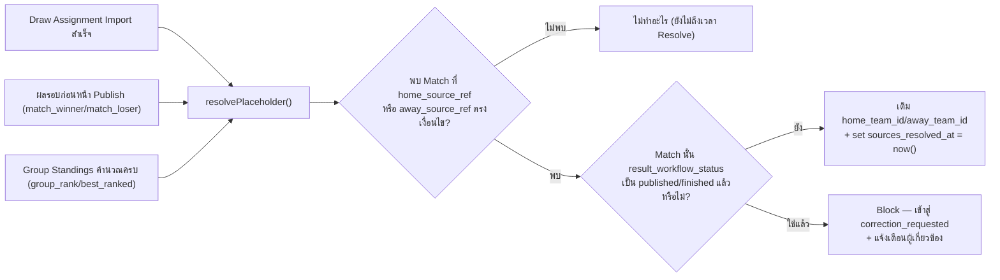
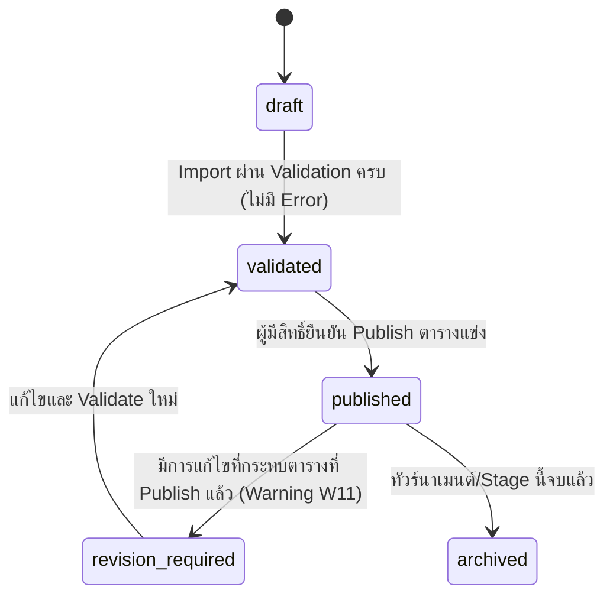
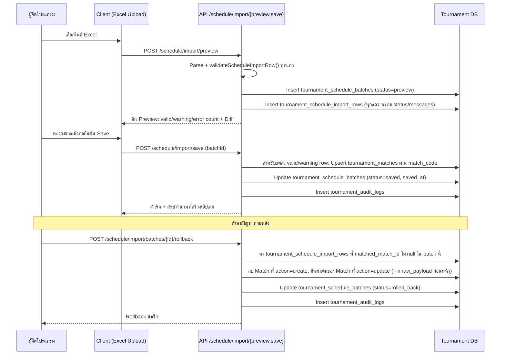
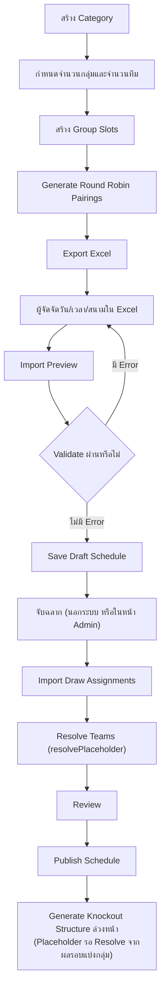
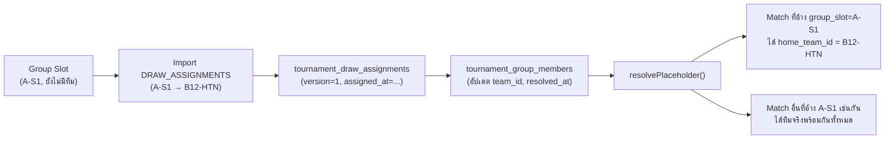

# Tournament V2 — Scheduling and Import

**สถานะ**: Proposal เท่านั้น รอการอนุมัติก่อนเริ่ม Implementation — เป็นส่วนขยายจาก `TOURNAMENT_V2_DATA_MODEL.md` (หมวด 2.7, 2.8, 2.8b, 2.15, 2.21) และ `TOURNAMENT_V2_TARGET_ARCHITECTURE.md` หมวด 12
**เพิ่มเข้ามาตาม**: ข้อกำหนดเรื่องการจัดโปรแกรมแข่งขัน/นำเข้า Excel/จับฉลาก/Placeholder รอบน็อกเอาต์ (Scheduling Addendum)
**อ้างอิง Gap ที่ต้องแก้จาก V1**: R8 ใน `TOURNAMENT_V2_CURRENT_STATE_AUDIT.md` หมวด 13 — V1 ไม่มีแนวคิด Group Slot/Draw/Placeholder เลย ต้องรู้ทีมจริงก่อนสร้างโปรแกรมแข่งขันเสมอ

---

## 1. Scheduling Strategy (Hybrid)

ระบบใช้แนวทาง **Hybrid**: Generate โครงในระบบ → Export ให้มนุษย์จัดวันเวลา/สนามใน Excel → Import กลับ → จับฉลากทีหลัง → ระบบ Resolve ทีมจริงอัตโนมัติ — ไม่ใช่ทั้ง "ระบบสุ่มทุกอย่างอัตโนมัติ" และไม่ใช่ "มนุษย์กรอกทุกอย่างเองทั้งหมด"

### รอบแบ่งกลุ่ม

```text
1. กำหนดจำนวนกลุ่มและจำนวนทีมต่อกลุ่ม
2. สร้าง Group Slot (ตำแหน่งในกลุ่ม เช่น A-S1, A-S2)
3. Generate คู่แข่งขันแบบ Round Robin จาก Group Slot
4. Export โปรแกรมไป Excel
5. ผู้จัดกำหนดวันที่ เวลา สนาม และลำดับคู่ใน Excel
6. Import Excel กลับเข้าระบบ
7. Preview และตรวจ Error / Warning ก่อนบันทึก
8. หลังจับฉลาก ให้ Import หรือกรอก Mapping ระหว่าง Group Slot กับทีมจริง (ไฟล์ DRAW_ASSIGNMENTS)
9. ระบบแทน Placeholder ด้วยทีมจริงอัตโนมัติ โดยไม่ต้องแก้ Match ทีละคู่
```

### รอบน็อกเอาต์

```text
1. วาง Match และวันเวลาไว้ล่วงหน้า
2. ใช้ Placeholder เช่นอันดับกลุ่ม ผู้ชนะคู่ก่อนหน้า ผู้แพ้รอบรอง หรือทีมอันดับ 3 ที่ดีที่สุด
3. ระบบ Resolve ทีมจริงอัตโนมัติเมื่อผลรอบก่อนหน้าผ่านการอนุมัติและ Publish แล้ว
4. รอบน็อกเอาต์ต้องไม่ผูกกับชื่อทีมจริงล่วงหน้า
```

**หลักการร่วม**: ทั้งสองรอบใช้ **Engine เดียวกัน** (`resolvePlaceholder()`, ดูหมวด 6) และ **โครงสร้างข้อมูลเดียวกัน** (`tournament_matches.home/away_source_type/ref`) — ไม่มี Business Logic แยกกันระหว่าง Group Stage กับ Knockout Stage สำหรับเรื่อง Placeholder

---

## 2. Placeholder Types (Source Definition)

`tournament_matches.home_source_type`/`away_source_type` รองรับ 9 ค่า (ดู `TOURNAMENT_V2_DATA_MODEL.md` หมวด 2.8):

| source_type | ความหมาย | รูปแบบ `source_ref` | ตัวอย่าง |
|---|---|---|---|
| `team` | ทีมจริงกำหนดตรงๆ | `TEAM_CODE` | `team \| B12-HTN` |
| `group_slot` | ตำแหน่งจับฉลาก (ก่อนแข่ง) | `GROUP-SLOT` | `group_slot \| A-S1` |
| `group_rank` | อันดับหลังจบรอบแบ่งกลุ่ม | `GROUP:RANK` | `group_rank \| A:1` |
| `match_winner` | ผู้ชนะจาก Match ก่อนหน้า | `MATCH_CODE` | `match_winner \| B-U12-R16-01` |
| `match_loser` | ผู้แพ้จาก Match ก่อนหน้า | `MATCH_CODE` | `match_loser \| B-U12-SF-01` |
| `best_ranked` | ทีมอันดับดีที่สุดข้ามกลุ่ม (โดยคะแนน/GD/GF) | `RULE_CODE:SLOT` | `best_ranked \| third_place:1` |
| `draw_selected` | ทีมเลือกจากจับฉลากคุณสมบัติ (D-29) | `QUALIFICATION_DRAW_SLOT_CODE` | `draw_selected \| G-U16-THIRD-DRAW-1` |
| `bye` | ไม่มีคู่แข่ง (ผ่านอัตโนมัติ) | `BYE` | `bye \| BYE` |
| `tbd` | ยังไม่กำหนด | `TBD` | `tbd \| TBD` |

### กฎสำคัญ: แยกแยะ Placeholder Types อย่างเด็ดขาด

#### `group_slot` vs `group_rank`

```text
A-S1 = ตำแหน่งจากการจับฉลาก (ก่อนแข่ง — ไม่เปลี่ยนตามผลการแข่งขัน)
A:1  = อันดับหลังการแข่งขัน (หลังแข่ง — เปลี่ยนตามผลจริง)
```

สองค่านี้ **ต้องไม่ปะปนกันในทุกจุดของระบบ** ทั้งใน Validation, Resolution Engine และ UI — Match รอบแบ่งกลุ่มใช้ `group_slot` เสมอ (คู่ในกลุ่มไม่เปลี่ยนตามผลแข่ง) ส่วน Match รอบน็อกเอาต์ที่มาจากอันดับกลุ่มใช้ `group_rank` เสมอ

#### `best_ranked` vs `draw_selected`

```text
best_ranked  = ทีมถูกเลือกตามอันดับ (Points → GD → GF → Fair Play → Draw)
draw_selected = ทีมถูกเลือกจากจับฉลากคุณสมบัติ (ไม่ใช้คะแนน/GD/GF)
```

- `best_ranked`: ใช้เมื่อเลือกทีมอันดับ 3 ที่ดีที่สุดข้ามหลายกลุ่ม โดยเรียงตามคะแนน/GD/GF ตามกติกา D-07 (ไม่ใช้เมื่อเลือก 2 จาก 3 ทีมอันดับ 3 ของ G-U16 ตาม D-29)
- `draw_selected`: ใช้เฉพาะเมื่อการเลือกทีมถูกตัดสินโดยจับฉลากแยกต่างหาก (D-29: G-U16 ต้องจับฉลากเลือก 2 จาก 3 ทีมอันดับ 3) — ไม่ใช่ placeholder ชั่วคราวสำหรับ best_ranked

ห้ามใช้ `best_ranked | third_place:1` เป็นหนึ่งในเซ็ท `[best_ranked | third_place:1, best_ranked | third_place:2]` สำหรับการเลือก G-U16 ตาม D-29 ให้ใช้ `draw_selected | G-U16-THIRD-DRAW-1` และ `draw_selected | G-U16-THIRD-DRAW-2` แทน

---

## 3. รูปแบบไฟล์โปรแกรมแข่งขัน (Fixture Excel Format)

**Columns**:

```text
match_code, category_code, stage, group_code, venue_code, court_code,
match_date, start_time, match_no, home_source_type, home_source_ref,
away_source_type, away_source_ref, result_policy, status, note
```

**ไม่ใช้ UUID ในไฟล์ Excel** — ใช้ `match_code` เป็น External Reference เสมอ ให้ Database สร้าง UUID เองตอน Import (ตรงกับ `TOURNAMENT_V2_DATA_MODEL.md` หมวด 12.1 ของ Target Architecture — Human-Readable Reference)

**DECISION LOCKED (D-16, 2026-07-14)**: `result_policy` มีค่า Default = `single_step` ทุกนัด (Single-step Result Submission with Mandatory Preview, ไม่มีผู้อนุมัติคนที่สอง) ไม่มีข้อยกเว้นตาม Stage ในคำตัดสินนี้ — Column ยังคงอยู่ในไฟล์ Excel เผื่อความยืดหยุ่นในอนาคต แต่ตัวอย่างด้านล่างปรับให้สะท้อน Default ปัจจุบัน

### ตัวอย่างรอบแบ่งกลุ่มก่อนจับฉลาก

```text
match_code: B-U12-GA-001
category_code: B-U12
stage: group
group_code: A
venue_code: V1
court_code: C1
match_date: 2026-08-01
start_time: 08:30
match_no: 1
home_source_type: group_slot
home_source_ref: A-S1
away_source_type: group_slot
away_source_ref: A-S2
result_policy: single_step
status: scheduled
```

### ตัวอย่างรอบ 16 ทีม (Placeholder จากอันดับกลุ่ม)

```text
match_code: B-U12-R16-01
category_code: B-U12
stage: round_of_16
venue_code: V1
home_source_type: group_rank
home_source_ref: A:1
away_source_type: group_rank
away_source_ref: B:2
result_policy: single_step
status: scheduled
```

### ตัวอย่างรอบ 8 ทีม (Placeholder จากผู้ชนะนัดก่อนหน้า)

```text
home_source_type: match_winner
home_source_ref: B-U12-R16-01

away_source_type: match_winner
away_source_ref: B-U12-R16-02
```

### ตัวอย่างชิงอันดับ 3 (Placeholder จากผู้แพ้รอบรองฯ)

```text
home_source_type: match_loser
home_source_ref: B-U12-SF-01

away_source_type: match_loser
away_source_ref: B-U12-SF-02
```

### ตัวอย่างรอบ 8 ทีม G-U16 (Placeholder จากจับฉลากคุณสมบัติตาม D-29)

```text
match_code: G-U16-QF-001
category_code: G-U16
stage: quarter_final
venue_code: V1
court_code: C1
match_date: 2026-08-05
start_time: 14:00
match_no: 15
home_source_type: group_rank
home_source_ref: A:1
away_source_type: draw_selected
away_source_ref: G-U16-THIRD-DRAW-1
result_policy: single_step
status: scheduled
```

**การ Resolve**:
- `home_source_type: group_rank` → ระบบเลือก A:1 (อันดับที่ 1 ของกลุ่ม A) หลังจบรอบแบ่งกลุ่ม โดยใช้คะแนน/GD/GF ตามกติกา
- `away_source_type: draw_selected` → ระบบ **ไม่** ใช้คะแนน/GD/GF ในการเลือก — ระบบรอให้ผู้จัดจับฉลากแยกต่างหาก และบันทึกผลจับฉลากเข้าระบบผ่าน Qualification Draw Management API
- ไม่ใช้ `best_ranked | third_place:1` แม้ว่าจะเลือกทีมอันดับ 3 ที่ดีที่สุด เพราะ D-29 บังคับให้ G-U16 ใช้จับฉลากแบบ **ไม่พิจารณาคะแนน**

**Mapping ไป Column ในฐานข้อมูล**: `venue_code`/`court_code` → `tournament_venues.code`/`tournament_courts.code`, `category_code` → `tournament_categories.code`, `group_code` → `tournament_groups.code` — ทุกตัวมี `code` field เพิ่มเข้ามาใน Data Model เพื่อรองรับ Format นี้โดยเฉพาะ (ดู `TOURNAMENT_V2_DATA_MODEL.md` หมวด 2.3, 2.3b, 2.7)

---

## 4. ไฟล์ผลจับฉลาก (`DRAW_ASSIGNMENTS`)

**Columns**:

```text
category_code, group_code, slot_code, team_code, team_name, draw_order, note
```

**ตัวอย่าง**:

```text
B-U12 | A | A-S1 | B12-HTN | โรงเรียนหัวถนนวิทยา    | 1 |
B-U12 | A | A-S2 | B12-CBR | โรงเรียนชลราษฎรอำรุง   | 2 |
B-U12 | A | A-S3 | B12-BNG | โรงเรียนบ้านบึง        | 3 |
B-U12 | A | A-S4 | B12-SAT | โรงเรียนสัตหีบวิทยาคม   | 4 |
```

**ระบบต้อง Resolve**:
```text
A-S1 → B12-HTN
A-S2 → B12-CBR
```
และแสดงชื่อทีมจริงในทุก Match ที่อ้าง Group Slot นั้น **โดยไม่เปลี่ยน Source Definition ดั้งเดิมของ Match** (`home_source_type='group_slot'`, `home_source_ref='A-S1'` ยังคงอยู่ถาวรแม้ `home_team_id` จะถูกเติมค่าแล้ว)

**ต้องเก็บทั้ง 4 อย่างต่อการจับฉลากหนึ่งครั้ง** (ตรงตาม `tournament_draw_assignments`, `TOURNAMENT_V2_DATA_MODEL.md` หมวด 2.8b):
1. Original Source (`group_slot | A-S1`)
2. Resolved Team ID
3. เวลาที่ Resolve (`assigned_at`)
4. Version ของ Draw Assignment (`version`, append-only)

หากมีการแก้ผลจับฉลาก ต้องมี Audit Log และตรวจผลกระทบต่อ Match ที่ Publish แล้ว (ดูหมวด 11 — Correction Workflow)

---

## 5. Group Slot Model และ Round Robin Generation Algorithm

### 5.1 Data Model

Group Slot ไม่ใช่ตารางแยก — ยุบรวมเข้า `tournament_group_members` โดยเพิ่ม `slot_code` + ทำให้ `team_id` nullable (ดูเหตุผลเต็มใน `TOURNAMENT_V2_DATA_MODEL.md` หมวด 2.7) เพราะเป็น Entity เดียวกัน เพียงคนละช่วงเวลาของ Lifecycle:

```text
ก่อนจับฉลาก:  { group_id: A, slot_code: 'A-S1', team_id: null }
หลังจับฉลาก:  { group_id: A, slot_code: 'A-S1', team_id: <uuid ของ B12-HTN>, resolved_at: ... }
```

### 5.2 Round Robin Generation Algorithm (Circle Method)

ตัวอย่างกลุ่ม 4 ทีม:
```text
A-S1, A-S2, A-S3, A-S4

Round 1: A-S1 vs A-S2 | A-S3 vs A-S4
Round 2: A-S1 vs A-S3 | A-S2 vs A-S4
Round 3: A-S1 vs A-S4 | A-S2 vs A-S3
```

**Algorithm มาตรฐาน (Circle Method)**: ตรึงทีมแรกไว้ตำแหน่งเดิม หมุนทีมที่เหลือตามเข็มนาฬิกาทีละ Round — รองรับ:

| ขนาดกลุ่ม | จำนวน Round | หมายเหตุ |
|---|---|---|
| 3 ทีม | 3 | แต่ละ Round มี 1 คู่ + 1 Bye (Internal Bye ใน Algorithm ไม่ใช่ Match จริง) |
| 4 ทีม | 3 | 2 คู่ต่อ Round พอดี |
| 5 ทีม | 5 | แต่ละ Round มี 2 คู่ + 1 Bye |
| 6 ทีม | 5 | 3 คู่ต่อ Round พอดี |

**จำนวนทีมเป็นเลขคี่**: เติม "Internal Bye" เข้าไปในการคำนวณ Algorithm (นับเป็นทีมที่ 4/6 สมมติ) — ทีมที่จับคู่กับ Internal Bye ใน Round นั้น**ไม่มี Match จริงเกิดขึ้น** (ไม่ insert `tournament_matches` แถวเปล่า) ต่างจาก Knockout Bye ที่ต้องมี Match Row จริงเพื่อให้ Bracket เดินหน้าอัตโนมัติได้ (ดูหมวด 2.8 ของ Data Model)

**Home/Away Balance**: สลับ Home/Away ระหว่าง Round ให้แต่ละทีมได้เป็น Home และ Away จำนวนใกล้เคียงกันที่สุดเท่าที่ทำได้ในจำนวน Round ที่มี (Unit Test ต้องตรวจสอบว่าผลต่างไม่เกิน 1 นัด)

**Generate ซ้ำแบบ Idempotent**: เรียก Generate ด้วย Input เดียวกัน (จำนวนทีม, Slot เดิม) ต้องได้ผลลัพธ์ **เหมือนเดิมทุกครั้ง** (Deterministic ไม่ใช่ Random) — เพื่อให้ Preview/Regenerate คาดเดาได้และไม่สร้างคู่ซ้ำโดยไม่ตั้งใจ

**ป้องกันคู่ซ้ำ**: ก่อน Insert ตรวจ `pairKey(stage, group_id, slotA, slotB)` ซ้ำกับที่มีอยู่แล้วหรือไม่ (Pattern เดียวกับ `pairKey()` ที่มีอยู่แล้วใน V1's `lib/tournament-fixtures.ts:110`)

**Regenerate โดยไม่เขียนทับ Match ที่จัดวันเวลาแล้ว**: ถ้า Match (Slot pairing เดิม) มี `match_date`/`match_time`/`venue_id` ตั้งค่าแล้ว (ไม่ใช่ค่าเริ่มต้น) **ต้อง Block การ Regenerate ทับแถวนั้นโดยไม่มีการยืนยัน** — แสดง Warning ให้ผู้ใช้เลือกว่าจะข้ามแถวนี้หรือยืนยันเขียนทับจริง

---

## 6. Placeholder Resolution Engine

`resolvePlaceholder()` เป็น Service กลางที่ถูกเรียกจาก 3 จุด (ดู `TOURNAMENT_V2_TARGET_ARCHITECTURE.md` หมวด 12.2):



**Input**: `{ triggerType: 'draw' | 'match_published' | 'standings_computed', triggerRef: string }`
**Process**: ค้นหา `tournament_matches` ทั้งหมดที่ `home_source_ref = triggerRef OR away_source_ref = triggerRef` (หรือ pattern ที่ตรงกับ `group_rank`/`best_ranked` ที่คำนวณใหม่) แล้ว resolve ทีละนัด
**Output**: รายการ Match ที่ resolve สำเร็จ + รายการที่ถูก Block เพราะกระทบ Match ที่ Publish แล้ว

**Idempotent**: เรียกซ้ำด้วย Input เดิมต้องไม่เปลี่ยนผลลัพธ์ (ถ้า resolve แล้วและไม่มีอะไรเปลี่ยน ไม่ทำอะไรซ้ำ)

---

## 7. Import Preview Workflow และ Validation Matrix

### 7.1 Workflow

```text
Upload Excel → Parse → Validate ทีละแถว → แสดง Preview (Valid/Warning/Error count) →
ผู้ใช้ยืนยัน → Save เฉพาะ Valid Rows → บันทึกลง tournament_schedule_batches + tournament_schedule_import_rows →
สร้าง/อัปเดต tournament_matches จริง
```

### 7.2 Validation Matrix — Error (Block การบันทึกแถวนั้น)

| # | กติกา | ตรวจสอบใน |
|---|---|---|
| E1 | `match_code` ซ้ำ (ภายในไฟล์เดียวกันหรือกับข้อมูลเดิม) | `validateScheduleImportRow.ts` |
| E2 | Category ไม่มีอยู่จริง | เทียบกับ `tournament_categories.code` |
| E3 | Venue ไม่มีอยู่จริง | เทียบกับ `tournament_venues.code` |
| E4 | Court ไม่มีอยู่จริง | เทียบกับ `tournament_courts.code` (scope ภายใน venue) |
| E5 | Group ไม่มีอยู่จริง | เทียบกับ `tournament_groups.code` (scope ภายใน category) |
| E6 | Group Slot ไม่มีอยู่จริง | เทียบกับ `tournament_group_members.slot_code` |
| E7 | Team ไม่มีอยู่จริง (เมื่อ `source_type='team'`) | เทียบกับ `tournament_teams.team_code` |
| E8 | Match อ้างตัวเอง (`home_source_ref = match_code` ของตัวเอง) | ตรวจ self-reference |
| E9 | `match_winner`/`match_loser` อ้าง Match ที่ไม่มีอยู่จริง | เทียบกับ `match_code` อื่นในไฟล์เดียวกันหรือในระบบ |
| E10 | Venue/Court เดียวกันมี Match เวลาเดียวกัน (Double-booking) | เทียบ `(venue_id, court_id, match_date, start_time)` |
| E11 | ทีมเดียวกันแข่งเวลาเดียวกัน (สองนัดพร้อมกัน) | เทียบ `(team_id, match_date, start_time)` ข้าม Match ทั้งหมด |
| E12 | Home และ Away Resolve เป็นทีมเดียวกัน | ตรวจหลัง Resolve (หรือก่อน ถ้าเป็น `source_type='team'` ตรงๆ) |
| E13 | Group Match ใช้ทีมที่ไม่ได้อยู่ในกลุ่มนั้น | เทียบ `tournament_group_members` ของ group_id นั้น |
| E14 | BYE อยู่ทั้งสองฝั่ง (`home_source_type='bye' AND away_source_type='bye'`) | ตรวจคู่ source_type |
| E15 | รอบน็อกเอาต์ที่ต้องมีผู้ชนะแต่ Source ไม่สมบูรณ์ (เช่น `match_winner` อ้าง Match ที่เป็น Group Stage) | ตรวจ stage ของ Match ต้นทาง |
| E16 | วันที่อยู่นอกช่วง Tournament (`match_date` ไม่อยู่ระหว่าง `tournaments.start_date`/`end_date`) | เทียบกับ `tournaments` |
| E17 | Import ไฟล์ผิด Category หรือ Tournament (แถวส่วนใหญ่ใน Batch อ้าง Category/Tournament ที่ผู้ใช้ไม่ได้เลือกไว้) | ตรวจระดับ Batch ก่อน Process ทีละแถว |
| E18 | **ใหม่ — DECISION LOCKED (D-24, 2026-07-14)**: Venue มี Match เกิน `venue_max_matches_per_day` (Default = 8) ในวันเดียวกัน | นับจำนวน Match ต่อ `venue_id`/`match_date` เทียบกับ Config `venue_max_matches_per_day` |

### 7.3 Validation Matrix — Warning (บันทึกได้ แต่แจ้งเตือน)

> **DECISION LOCKED (D-24, 2026-07-14)**: W3 และ W4 **ปิดใช้งานใน MVP** — เจ้าของระบบตัดสินใจไม่ Validate `minimum_rest_minutes`/`max_matches_per_team_per_day` ในรอบนี้ (ไม่ใช่แค่รอ Threshold แต่เป็นการตัดสินใจไม่ Validate เลย) ทำเครื่องหมายเป็น Future Enhancement — **ห้ามใส่ค่า Threshold ที่เดาขึ้นมาเอง**

| # | กติกา | ตรวจสอบใน |
|---|---|---|
| W1 | Category ถูกจัดลงสนามที่ไม่ใช่สนามหลัก (ไม่ตรง `tournament_category_venues.is_primary=true`) | เทียบกับ Data Model หมวด 2.3c |
| W2 | ทีมแข่งติดกัน (Match ติดกันไม่มีช่วงพัก) | คำนวณช่วงเวลาระหว่างนัดของทีมเดียวกัน |
| W3 | ~~ระยะพักต่ำกว่าเกณฑ์~~ **DISABLED ใน MVP (D-24)** — `minimum_rest_minutes` ไม่ Validate ในรอบนี้ | Future Enhancement |
| W4 | ~~ทีมแข่งมากกว่า 1 Match ต่อวัน~~ **DISABLED ใน MVP (D-24)** — `max_matches_per_team_per_day` ไม่ Validate ในรอบนี้ | Future Enhancement |
| W5 | จำนวนคู่ต่อวันเกินค่าที่แนะนำ **ระดับ Court** (ระดับ Venue ใช้ E18 เป็น Error แทนแล้วตาม D-24) | นับจำนวน Match ต่อ court/วัน |
| W6 | Match ไม่มี Court ระบุ | ตรวจ `court_code` ว่าง |
| W7 | Match เริ่มก่อนเวลาเปิดสนามหรือหลังเวลาปิดสนาม | เทียบกับ Config เวลาทำการสนาม (ถ้ามี) |
| W8 | Placeholder ยัง Resolve ไม่ได้ (ปกติสำหรับ Fixture ก่อนจับฉลาก — เป็น Warning ไม่ใช่ Error) | ตรวจ `home_team_id`/`away_team_id` เป็น null |
| W9 | รอบก่อนหน้าอาจแข่งจบใกล้เวลาเริ่มรอบถัดไป (เสี่ยง Advancement ไม่ทัน) | เทียบเวลาจบโดยประมาณของนัดต้นทางกับเวลาเริ่มนัดปลายทาง |
| W10 | Match Number ไม่ต่อเนื่อง (มีช่องว่างใน `match_no`) | ตรวจลำดับ `match_no` ภายใน stage |
| W11 | มีการเปลี่ยนโปรแกรมที่ Publish แล้ว (`tournament_schedule_versions.status='published'`) | เทียบกับสถานะ Schedule ปัจจุบันก่อน Apply การเปลี่ยนแปลง |

### 7.4 Import ต้องมี

- Preview ก่อนบันทึกเสมอ (ไม่มี Save ตรงจาก Upload)
- สรุปจำนวน: Valid Rows / Warning Rows / Error Rows
- Save เฉพาะ Valid Rows (Error Rows ถูกข้ามเสมอ, Warning Rows บันทึกได้พร้อมข้อความเตือนติดไปด้วย)
- **Idempotency**: Import ไฟล์เดิมซ้ำ (เช่น กด Import สองครั้งเพราะเน็ตหลุด) ต้องไม่สร้าง Match ซ้ำ — ใช้ `match_code` ตรวจว่ามีอยู่แล้วหรือไม่
- **Update Existing Match ผ่าน `match_code`**: ถ้า `match_code` มีอยู่แล้วในระบบ ให้ Update แถวนั้นแทนการสร้างใหม่ (`action='update'`)
- **Diff Preview**: แสดงค่าที่จะเปลี่ยนเทียบกับข้อมูลเดิม (เช่น "เวลาเปลี่ยนจาก 08:30 → 09:00") ก่อนยืนยัน Save
- Audit Log ทุก Batch (ใครนำเข้า, กี่แถว, เวลาไหน)
- **Rollback Import Batch**: ลบ/คืนค่า Match ที่ Batch นั้นสร้างหรือแก้ไข กลับสู่สถานะก่อน Import (ดูหมวด 9)

---

## 8. Schedule Status Model

**มิติที่ 3 แยกจาก Match Status และ Result Workflow Status** (ดู `TOURNAMENT_V2_VENUE_OPERATIONS.md` หมวด 10):



**Scope**: ต่อ `(category_id, stage)` หนึ่งคู่ — Category เดียวกันอาจมี Group Stage `published` แล้วในขณะที่ Knockout Stage ยังเป็น `draft` (เพราะยังไม่จับฉลากอันดับกลุ่มเสร็จ)

**ความสัมพันธ์กับ Match Status/Result Workflow Status**: เป็นอิสระต่อกันทั้ง 3 มิติ — ตัวอย่าง: Schedule `published` (ตารางแข่งประกาศแล้ว สาธารณะเห็นวันเวลา) + Match `scheduled` (ยังไม่แข่ง) + Result Workflow `not_started` (ยังไม่มีผล) เป็นสถานะปกติของนัดที่ยังไม่ถึงกำหนดแข่ง

---

## 9. Import Batch และ Rollback



**ข้อจำกัดของ Rollback**: ถ้า Match ใน Batch นั้นถูกแก้ไขต่อโดย Batch อื่นหรือ Admin หลังจาก Import แล้ว (เช่น มีการกรอกผลไปแล้ว) **Rollback ต้อง Block และแจ้งเตือน** ไม่ใช่เขียนทับข้อมูลใหม่กว่าทิ้งไปเงียบๆ — ตรวจผ่าน `updated_at`/Version เทียบกับเวลาที่ Batch นั้น Save

---

## 10. Venue / Category / Master Views

### Venue View
```text
สนามที่ 1 — วันที่ 1 สิงหาคม 2569

08:30 ชาย U12 กลุ่ม A
A-S1 vs A-S2

09:30 หญิง U14 กลุ่ม A
A-S1 vs A-S2
```

### Category View
```text
ชาย U12
- Group A
- Group B
- Round of 16
- Quarter-final
- Semi-final
- Third-place
- Final
```

### Master Schedule View
```text
วันที่ | สนาม 1 | สนาม 2 | สนาม 3 | สนาม 4
```

### Unscheduled View
แสดง Match ที่ Generate คู่แล้วแต่ยังไม่มี: วันที่ / เวลา / สนาม / Court — ใช้ Query `tournament_matches WHERE match_date IS NULL OR venue_id IS NULL`

### Conflict View
รวม Error และ Warning ที่ยังไม่ได้แก้ (จาก `tournament_schedule_import_rows.status IN ('error','warning')` ของ Batch ล่าสุด + Conflict ที่ตรวจพบภายหลัง เช่น Double-booking ที่เกิดจากการแก้ Match เดี่ยวๆ ในเว็บโดยตรงไม่ผ่าน Import)

ทั้ง 4 Views ใช้ API เดียวกัน (`/api/tournament/admin/schedule` filter ต่างกัน) ไม่ Duplicate Query Logic

---

## 11. Re-resolve และ Correction Workflow (เชื่อมกับ Result Workflow เดิม)

```text
Match ต้องเก็บ Source Definition ของทั้งสองฝั่งเสมอ (ห้ามลบหลัง Resolve)
Match อาจยังไม่มี home_team_id/away_team_id (สถานะ TBD)
เมื่อ Resolve ได้แล้วจึงเติม Resolved Team ID (home_team_id/away_team_id)
ต้องสามารถ Re-resolve ได้หลังแก้ Draw หรือผลการแข่งขัน (เช่น แก้ผลจับฉลากใหม่, แก้ผลรอบก่อนหน้า)

การ Re-resolve ที่กระทบ Match ซึ่ง Publish หรือ Finished แล้ว:
  → Block การเขียนทับอัตโนมัติ
  → เข้าสู่ Correction Workflow เดิม (result_workflow_status = correction_requested)
  → ต้องมีผู้มีสิทธิ์ระดับ venue_manager ขึ้นไปยืนยันก่อน (เหมือน Correction ผลการแข่งขันปกติ — ดู TOURNAMENT_V2_VENUE_OPERATIONS.md หมวด 13)
```

**เหตุผลที่ใช้ Correction Workflow เดียวกัน**: ลดจำนวน State Machine ที่ทีมต้องเรียนรู้/ทดสอบ/ดูแล — "แก้ผลบอล" กับ "แก้ว่าใครมาแข่ง" เป็นความเสี่ยงระดับเดียวกัน (กระทบผลที่ประกาศไปแล้ว) จึงควรผ่านกระบวนการอนุมัติระดับเดียวกัน

---

## 12. Data Model ที่ประเมินแล้ว — Necessary vs Merge

| Candidate Table | คำตัดสิน | เหตุผลสรุป |
|---|---|---|
| `tournament_group_slots` | **ยุบรวมเข้า `tournament_group_members`** | Entity เดียวกัน (ตำแหน่งในกลุ่ม) ต่างแค่ก่อน/หลังจับฉลาก — เพิ่ม `slot_code` + `team_id` nullable พอ ไม่ต้องมี 2 ตาราง |
| `tournament_draw_assignments` | **จำเป็น แยกตาราง** | ต้องเป็น Append-only History พร้อม Version — คนละหน้าที่กับ Current State ใน `tournament_group_members` |
| `tournament_schedule_batches` | **จำเป็น แยกตาราง** | หัวไฟล์ Import จำเป็นสำหรับ Rollback ทั้ง Batch |
| `tournament_schedule_import_rows` | **จำเป็น แยกตาราง** | ต้องเก็บผล Validate ราย Row ก่อนกลายเป็น Match จริง (Preview/Diff) |
| `tournament_schedule_versions` | **จำเป็น แยกตาราง** | Schedule Status เป็นมิติที่ 3 คนละเรื่องกับ Match Status/Result Workflow Status |
| `tournament_match_sources` | **ยุบรวมเข้า `tournament_matches`** | ทุก Match (กลุ่ม/น็อกเอาต์) มี Source ได้เหมือนกัน แยกตารางจะเพิ่ม JOIN โดยไม่จำเป็นในทุก Query |

**ผลพลอยได้**: `tournament_bracket_matches` (จากรอบก่อนหน้า) ก็ถูกยุบรวมเข้า `tournament_matches` ด้วยเหตุผลเดียวกัน (ดู `TOURNAMENT_V2_DATA_MODEL.md` หมวด 2.15) — ทำให้ทั้งระบบเหลือ **ตารางเดียว (`tournament_matches`) เป็นแกนกลางของทุก Match** ไม่ว่ารอบแบ่งกลุ่มหรือน็อกเอาต์ ลดจุดที่ข้อมูลสองชุดต้องซิงค์กันเอง

---

## 13. MVP vs Future Scope

### MVP (รอบนี้)

- Generate Group Slots
- Generate Round Robin Pairings
- Export Excel
- Import Excel (Fixture + Draw Assignment)
- Preview / Validation (Error + Warning Matrix เต็มรูปแบบ)
- Edit Match รายคู่ในเว็บ
- Placeholder Resolution (ทั้ง 8 source_type)
- Generate Knockout Structure (วาง Match + Placeholder ล่วงหน้า)
- Venue / Category / Master / Unscheduled / Conflict Views

### Future Phase (ไม่อยู่ในขอบเขตรอบนี้)

- Drag and Drop Schedule Editor
- Suggest Available Slot อัตโนมัติ
- Semi-auto Scheduler
- Rest-time Constraint แบบ Enforce อัตโนมัติ (ตอนนี้เป็นแค่ Warning)
- Daily Match Limit แบบ Enforce อัตโนมัติ
- Venue Capacity Planning
- Locked Match (ป้องกันแก้ไขระดับ Field)
- Full Constraint Scheduler
- สร้าง Schedule หลายตัวเลือกและให้คะแนนคุณภาพ (Multi-candidate scheduling)

**เหตุผลที่ไม่ทำ Auto Scheduler ใน MVP**: ตามที่เจ้าของระบบยืนยันชัดเจนแล้วในข้อกำหนด — Hybrid Workflow (Generate โครง + มนุษย์จัดรายละเอียดใน Excel) เพียงพอสำหรับ Scale ของทัวร์นาเมนต์ระดับจังหวัด และลดความเสี่ยงจาก Algorithm ที่ซับซ้อนเกินความจำเป็นในรอบแรก

---

## 14. Acceptance Criteria

- [ ] จัด Schedule ก่อนจับฉลากได้ (Group Slot ใช้เป็นคู่แข่งขันรอบแบ่งกลุ่มได้จริง)
- [ ] หลังจับฉลาก กรอก Mapping เพียงครั้งเดียวแล้วทุก Match แสดงทีมจริงพร้อมกัน
- [ ] `group_slot` และ `group_rank` ไม่ปะปนกันในทุกจุด (Validation ปฏิเสธถ้าใช้ผิด context)
- [ ] วาง Placeholder รอบน็อกเอาต์ล่วงหน้าได้ครบทั้ง 8 source_type
- [ ] ผู้ชนะและผู้แพ้จาก Match ก่อนหน้าถูก Resolve อัตโนมัติเมื่อผล Publish
- [ ] Import ไฟล์เดิมซ้ำไม่สร้าง Match ซ้ำ (Idempotent ผ่าน `match_code`)
- [ ] Preview แสดง Diff, Error, และ Warning ครบตาม Validation Matrix
- [ ] ไม่คำนวณ Standings หรือ Bracket จาก Match ที่ยังเป็น Draft (Schedule Status ยังไม่ `published`)
- [ ] การแก้ Draw Assignment หรือ Match Source มี Audit Log ครบทุกครั้ง
- [ ] รองรับ 7 Categories และ 4 สนามตาม Mapping จริง
- [ ] League ไม่ได้รับผลกระทบจากงานนี้แต่อย่างใด (ตรวจด้วย `git diff` ต่อไฟล์ League)
- [ ] ไม่มี Production หรือ Migration Change เกิดขึ้นจริงในรอบนี้

---

## 15. Test Cases (สรุปเพื่อวางแผน — รายละเอียดเต็มอยู่ใน Implementation Phases แต่ละ Sub-phase)

### Round Robin Generation
- กลุ่ม 3/4/5/6 ทีม ได้จำนวน Round และคู่ถูกต้องตรงตามตัวอย่าง
- จำนวนทีมคี่มี Internal Bye ถูกต้อง ไม่สร้าง Match จริงสำหรับ Bye
- Home/Away Balance ต่างกันไม่เกิน 1 นัดต่อทีม
- Regenerate ด้วย Input เดิมได้ผลลัพธ์เหมือนเดิมทุกครั้ง (Idempotent)
- Regenerate ทับ Match ที่มีวันเวลาแล้วต้อง Block ไม่ยืนยันอัตโนมัติ

### Placeholder Resolution
- Resolve ครบทั้ง 8 source_type แยกกรณี
- `group_slot` resolve ได้ทันทีหลัง Import Draw Assignment
- `group_rank`/`best_ranked` resolve ได้ทันทีหลัง Standings คำนวณครบ
- `match_winner`/`match_loser` resolve ได้ทันทีหลังผลนัดต้นทาง Publish
- Re-resolve ที่กระทบ Match `published`/`finished` ต้อง Block เข้า Correction Workflow ไม่เขียนทับเงียบ

### Import Validation
- ทุกกติกา Error (E1-E17) มี Test Case ยืนยันว่า Block การบันทึกจริง
- ทุกกติกา Warning (W1-W11) มี Test Case ยืนยันว่าบันทึกได้แต่แจ้งเตือนถูกต้อง
- Import ไฟล์ผสม Valid/Warning/Error บันทึกเฉพาะ Valid+Warning ถูกต้อง ข้าม Error
- Import ซ้ำไฟล์เดิม (Retry) ไม่สร้างข้อมูลซ้ำ
- Rollback Batch คืนสถานะก่อน Import ถูกต้อง 100% รวมกรณี Match ถูกแก้ต่อหลัง Import (ต้อง Block Rollback)

### Draw Assignment
- Import DRAW_ASSIGNMENTS resolve slot ทุกแถวถูกต้อง
- แก้ผลจับฉลากซ้ำสร้าง version ใหม่ ไม่ update ทับของเดิม
- แก้ผลจับฉลากที่กระทบ Match ที่ Publish แล้วต้อง Block

---

## Mermaid Diagrams สรุปรวม (อ้างอิงจากหมวดต่างๆ ด้านบน)

1. **Placeholder Resolution Engine** — ดูหมวด 6
2. **Schedule Status State Diagram** — ดูหมวด 8
3. **Import Preview/Save/Rollback Sequence** — ดูหมวด 9
4. **Schedule Preparation Workflow** (ภาพรวมทั้งกระบวนการ):



5. **Group Slot → Draw Assignment → Resolved Team Flow**:



---

## Rollback Plan สำหรับเอกสารชุดนี้

เอกสารนี้เป็น Markdown ล้วน ไม่มีการแก้ไข Production/Schema/Route ใดๆ — Rollback คือไม่ merge branch `docs/tournament-v2-preparation` เข้า `main` เช่นเดียวกับเอกสารชุดอื่นในรอบ Preparation นี้ ไม่มีผลกระทบต่อ League หรือ Tournament V1 ที่ทำงานอยู่จริง
