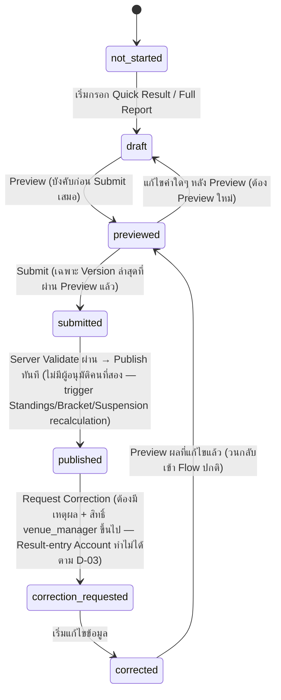
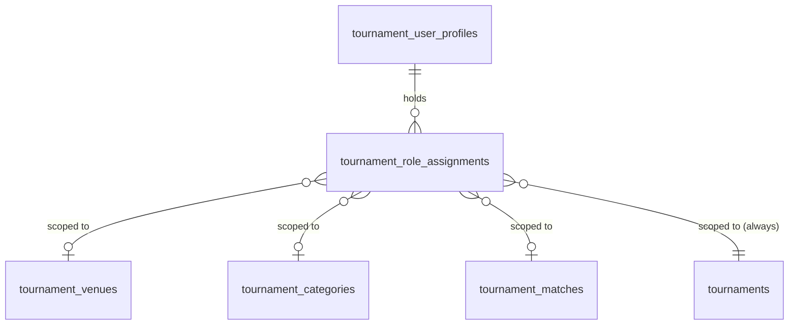
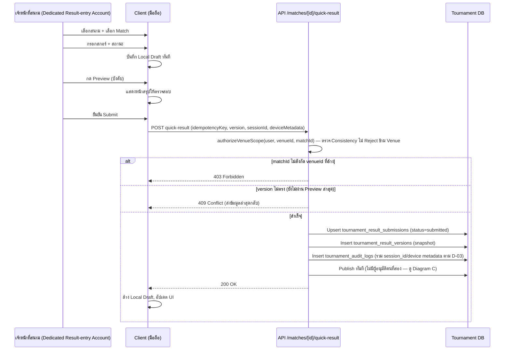
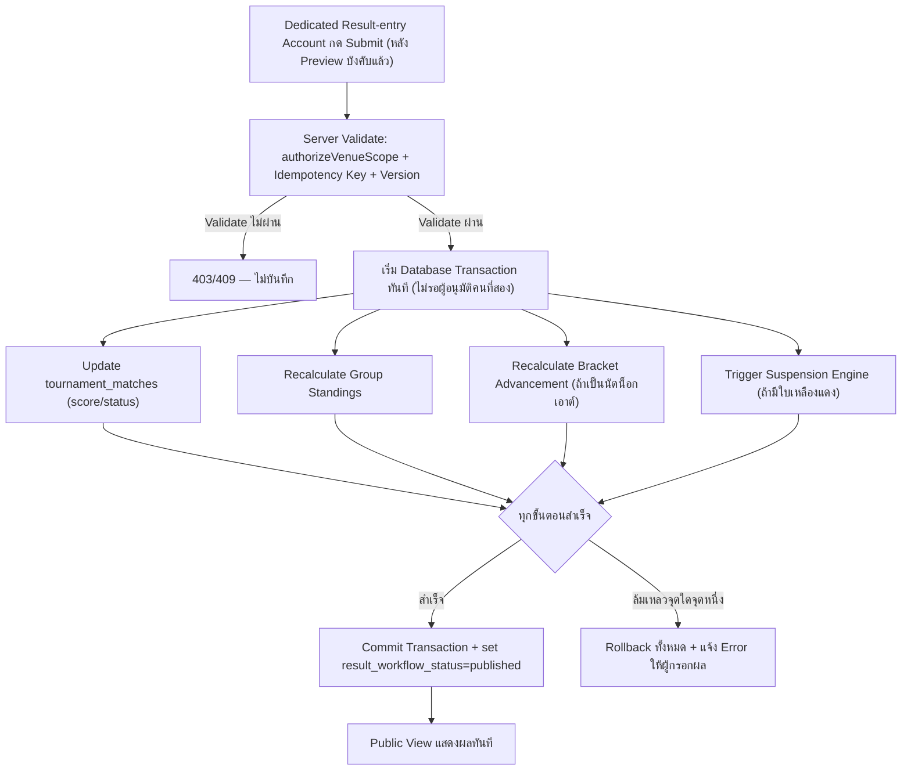

# Tournament V2 — Venue Operations

**สถานะ**: Proposal ที่ผ่าน Decision Lock บางส่วนแล้ว (2026-07-14) — ดู `TOURNAMENT_V2_DECISION_CHECKLIST.md` (โดยเฉพาะ D-03, D-16) สำหรับ Final Decision จุดที่มีคำว่า **DECISION LOCKED** คือคำตอบสุดท้าย — เอกสารนี้เป็นส่วนขยายจาก `TOURNAMENT_V2_TARGET_ARCHITECTURE.md` หมวด 11 และ `TOURNAMENT_V2_DATA_MODEL.md` หมวด 2.17-2.20
**เพิ่มเข้ามาตาม**: `TOURNAMENT_V2_PREPARATION_PLAN.md` revision `v1.1 — Multi-Venue Match Operations`
**บริบท**: รายการกีฬานักเรียนนักศึกษาจังหวัดชลบุรี ประเภทฟุตซอลเท่านั้น
**ปรับปรุงตาม Scheduling Addendum**: `result_policy` ที่หมวด 9 อธิบายไว้ ตอนนี้เป็นคอลัมน์จริงบน `tournament_matches.result_policy` (ตั้งค่าได้ต่อนัดผ่าน Excel Import) ไม่ใช่แค่ Recommendation ระดับ Category — ดู `TOURNAMENT_V2_SCHEDULING_AND_IMPORT.md` สำหรับ Excel Format เต็ม และหมวด 10 ด้านล่างซึ่งตอนนี้มี "Schedule Status" เป็นมิติที่ 3 เพิ่มจาก Match Status และ Result Workflow Status

---

## 1. Tournament Context และ Mapping 7 Categories เข้า 4 สนาม

### 1.1 ประเภทการแข่งขัน (7 Categories)

| Category Code | เพศ | รุ่นอายุ | สนามหลัก |
|---|---|---:|---|
| `B-U12` | ชาย | 12 ปี | สนามที่ 1 |
| `G-U14` | หญิง | 14 ปี | สนามที่ 1 |
| `B-U14` | ชาย | 14 ปี | สนามที่ 2 |
| `G-U16` | หญิง | 16 ปี | สนามที่ 2 |
| `B-U16` | ชาย | 16 ปี | สนามที่ 3 |
| `G-U18` | หญิง | 18 ปี | สนามที่ 3 |
| `B-U18` | ชาย | 18 ปี | สนามที่ 4 |

### 1.2 การจัดสนามหลัก

```text
สนามที่ 1
├── ชาย 12 ปี (B-U12)
└── หญิง 14 ปี (G-U14)

สนามที่ 2
├── ชาย 14 ปี (B-U14)
└── หญิง 16 ปี (G-U16)

สนามที่ 3
├── ชาย 16 ปี (B-U16)
└── หญิง 18 ปี (G-U18)

สนามที่ 4
└── ชาย 18 ปี (B-U18)
```

### 1.3 หลักการสำคัญ

ข้อมูลนี้เก็บเป็น **Configuration ในตาราง `tournament_category_venues`** (ดู `TOURNAMENT_V2_DATA_MODEL.md` หมวด 2.3c) **ห้าม Hardcode ลง UI หรือ Business Logic** เพราะทุกปีอาจมีการเปลี่ยนสนาม เพิ่มสนาม ย้ายรุ่นอายุ หรือเปลี่ยนจำนวน Category ระบบต้องรองรับ:

- สนามหลักประจำ Category (`is_primary = true`)
- การย้าย Match ข้ามไปสนามอื่นเป็นกรณีพิเศษ (นัดเดียว ไม่กระทบ Category ทั้งหมด — ทำผ่าน `tournament_matches.venue_id` ของนัดนั้นโดยตรง ไม่ต้องแก้ `tournament_category_venues`)
- สนามเดียวกันมีมากกว่าหนึ่ง Court บันทึกผลพร้อมกันได้ (`tournament_courts`)
- กลุ่มและรอบน็อกเอาต์ที่อาจเปิดในสนามใดหรือหลายสนามก็ได้ (ไม่ผูก Group/Bracket เข้ากับ Venue โดยตรงในระดับ Schema)
- เพิ่มสนามหรือ Category ภายหลังโดยไม่กระทบ Schema หลัก (Insert แถวใหม่เข้า `tournament_venues`/`tournament_categories`/`tournament_category_venues` เท่านั้น)

---

## 2. Venue / Court Data Model

อ้างอิงเต็มจาก `TOURNAMENT_V2_DATA_MODEL.md` หมวด 2.3-2.3c — สรุปความสัมพันธ์:

```text
tournament_venues (สนามที่ 1-4)
  └── tournament_courts (คอร์ตย่อยภายในสนาม, 0..N)
  └── tournament_category_venues (many-to-many กับ tournament_categories)
  └── tournament_matches.venue_id / court_id (นัดแข่งแต่ละนัดผูกสนาม/คอร์ตจริงที่ใช้)
```

**field สำคัญที่เพิ่มจาก V1**: `tournament_venues.slug` (สำหรับ Public URL), `tournament_venues.sort_order` (แสดงผล "สนามที่ 1-4" ตามลำดับ), `tournament_matches.court_id` (แยกจาก `venue_id`)

---

## 3. Category-to-Venue Assignment

การกำหนด/แก้ไข Mapping ทำผ่านหน้า Admin (`app/admin/tournament/(setup)/category-venues/page.tsx`) เท่านั้น — ไม่มี Public หรือ Venue-level user คนใดแก้ Mapping นี้ได้ (สงวนสิทธิ์ให้ `tournament_super_admin` เท่านั้น เพราะกระทบ RBAC Scope ของทุกคนที่ผูกกับ `venue_id`/`category_id`)

**ผลกระทบเมื่อเปลี่ยน Mapping กลางทัวร์นาเมนต์**: นัดที่ตารางออกไปแล้ว (มี `venue_id` ผูกอยู่ใน `tournament_matches` ของตัวเอง) **ไม่เปลี่ยนอัตโนมัติ** ตามการแก้ Mapping — ต้องอัปเดตทีละนัดหรือใช้ Bulk Action แยกต่างหาก (ดู Open Question Q21 ใน `TOURNAMENT_V2_OPEN_QUESTIONS.md`)

---

## 4. User Roles และ Permission Matrix

### 4.1 Roles (สรุปจาก Target Architecture หมวด 11.2)

| Role | Scope | ความสามารถหลัก | Account Model |
|---|---|---|---|
| `tournament_super_admin` | ทั้งรายการ | จัดการทุกอย่าง: รายการ ผู้ใช้ กติกา สนาม ข้อมูลทุกส่วน | รายบุคคล |
| `central_control` | ทั้งรายการ | ดูสถานะ 4 สนาม, ตรวจ/แก้ Conflict ข้ามสนาม, จัดการคำร้องขอแก้ไข (Correction เท่านั้น — ไม่มี Approve ผลปกติแล้วตาม D-16) | รายบุคคล |
| `venue_manager` | สนามที่ได้รับมอบหมาย | ควบคุม Matchday Dashboard, ยืนยัน/โยกย้ายตารางแข่งภายในสนามตน, Request Correction | รายบุคคล |
| `result_operator` | ทุกสนาม (เลือกเองในแอปทุก Session) | กรอกผลการแข่งขัน (Quick Result + Full Match Report) แบบ Single-step + Mandatory Preview, ประตู, ใบเหลืองแดง | **DECISION LOCKED (D-03, 2026-07-14) — Dedicated Shared Account** (1 บัญชีร่วม ไม่ใช่รายบุคคล) |
| `match_official` | เฉพาะ Match ที่ได้รับมอบหมาย | ตรวจ/ยืนยันผลและรายงานเฉพาะนัดของตัวเอง | รายบุคคล |
| `read_only` | ตาม Scope ที่กำหนด | ดูข้อมูลอย่างเดียว | รายบุคคล |

**DECISION LOCKED (D-03, 2026-07-14)**: `result_operator` เป็นข้อยกเว้นเดียวจากหลักการ "บัญชีรายบุคคลเท่านั้น" — ดูรายละเอียดสิทธิ์ที่อนุญาต/ห้าม และ Non-repudiation Limitation เต็มที่ `TOURNAMENT_V2_DECISION_CHECKLIST.md` D-03

### 4.2 Permission Matrix

> **DECISION LOCKED (D-16, 2026-07-14)**: Result Workflow เปลี่ยนเป็น Single-step Result Submission with Mandatory Preview — **ไม่มี Approve Step แยกสำหรับ Submission ปกติอีกต่อไป** Submit ที่ผ่าน Server Validate แล้ว = Publish ทันที ตารางด้านล่างปรับตามคำตัดสินนี้

| Action | `tournament_super_admin` | `central_control` | `venue_manager` | `result_operator` (Shared) | `match_official` | `read_only` |
|---|:---:|:---:|:---:|:---:|:---:|:---:|
| ตั้งค่า Tournament/Category/Venue | ✅ | ❌ | ❌ | ❌ | ❌ | ❌ |
| แก้ Category↔Venue Mapping | ✅ | ❌ | ❌ | ❌ | ❌ | ❌ |
| จัดการ Role Assignment | ✅ | ❌ (เสนอแต่ไม่อนุมัติเอง) | ❌ | ❌ | ❌ | ❌ |
| ดู Matchday Dashboard | ✅ | ✅ (ทุกสนาม) | ✅ (สนามตน) | ✅ (เลือกสนามเองในแอป) | ✅ (เฉพาะ Match ตน) | ✅ (ตาม Scope) |
| กรอก Quick Result | ✅ | ❌ | ✅ | ✅ | ❌ | ❌ |
| กรอก Full Match Report | ✅ | ❌ | ✅ | ✅ | ✅ (เฉพาะ Match ตน) | ❌ |
| Preview ผล (บังคับก่อน Submit) | ✅ | ❌ | ✅ | ✅ | ✅ (เฉพาะ Match ตน) | ❌ |
| Submit ผล (= Publish ทันทีตาม Single-step) | ✅ | ❌ | ✅ | ✅ | ✅ (เฉพาะ Match ตน) | ❌ |
| Request Correction (บนผลที่ Published แล้ว) | ✅ | ✅ | ✅ (สนามตน) | ❌ (ห้ามตาม D-03) | ❌ | ❌ |
| แก้ไข/Submit ผลที่ถูก Correction แล้ว (`corrected→previewed→submitted→published`) | ✅ | ❌ | ✅ | ✅ (เฉพาะขั้นตอน Preview/Submit ปกติ หลัง Correction ถูกเปิดแล้ว) | ✅ (เฉพาะ Match ตน) | ❌ |
| ดู Central Control Center | ✅ | ✅ | ❌ | ❌ | ❌ | ❌ |
| ดู Audit Log ทั้งหมด | ✅ | ✅ | ❌ (เฉพาะสนามตน) | ❌ | ❌ | ❌ |
| Import/Rollback โปรแกรมแข่งขัน, สร้าง/ลบ Tournament, แก้กติกา, จัดกลุ่ม, แก้ Draw Assignment | ✅ (ตาม Role จริง) | ❌ | ❌ | ❌ (ห้ามตาม D-03) | ❌ | ❌ |

### 4.3 Venue Scope Matrix (ตัวอย่าง)

| User | Venue | Category | Match Scope | Allowed Actions |
|---|---|---|---|---|
| สมชาย (venue_manager) | สนามที่ 1 | ทั้งหมดในสนาม 1 (B-U12, G-U14) | ทุกนัดในสนาม 1 | ควบคุม Matchday, ยืนยัน/โยกย้ายตาราง, Request Correction |
| Dedicated Result-entry Account (`result_operator`, **DECISION LOCKED D-03**) | ทุกสนาม (เลือกเองในแอปทุก Session) | ทุก Category | ทุกนัดที่เลือกในแอป — Server ตรวจ Consistency ว่า Match สังกัด Venue ที่อ้างจริง | กรอกผล + Preview + Submit (=Publish ทันที) ตาม D-16 — **บัญชีเดียวใช้ร่วมกันทุกสนาม/ทุกเจ้าหน้าที่ ไม่แยกตามสนามหรือ Category แบบเดิมอีกต่อไป** |
| กรรมการ A (match_official) | — | — | เฉพาะ Match ID ที่มอบหมาย | ตรวจ/ยืนยันเฉพาะนัดของตน |
| ผู้บริหาร (central_control) | ทั้งหมด | ทั้งหมด | ทั้งหมด | ดูภาพรวม + จัดการ Correction เท่านั้น (ไม่มี Approve ผลปกติแล้ว) |

**กฎบังคับ**: Server ต้องตรวจ Scope จริงทุกครั้งจาก `tournament_role_assignments` ห้ามเชื่อค่า `venueId`/`categoryId` ที่ Client ส่งมา (ดู Target Architecture หมวด 11.3 และ Current State Audit R7) — สำหรับ `result_operator` (Shared Account) Server ตรวจ **Consistency** ว่า `match_id` สังกัด `venue_id` ที่อ้างจริง แทนการ Reject ข้าม Venue เหมือน Role อื่น เพราะบัญชีนี้มีสิทธิ์ทุกสนามโดยเจตนาตาม D-03

---

## 5. Venue-Scoped Authorization

```text
1. Client ส่ง Request พร้อม JWT (จาก League Supabase Identity Provider หรือ Shared Result-entry Session สำหรับ `result_operator`)
2. API Route เรียก authorizeVenueScope(userId, { venueId?, categoryId?, matchId? })
3. authorizeVenueScope():
   a. Query tournament_role_assignments WHERE user_id = userId
   b. ตรวจว่ามี row ใดที่ scope ครอบคลุมคำขอนี้หรือไม่
      - tournament_super_admin / central_control: อนุญาตทุกกรณี (tournament_id ตรง)
      - venue_manager: ต้องมี venue_id ตรง (และ category_id ตรงถ้าระบุ)
      - match_official: ต้องมี match_id ตรงเป๊ะ
      - **result_operator (DECISION LOCKED D-03, 2026-07-14 — Shared Account)**: ไม่ Reject ข้าม Venue — ตรวจ **Consistency** แทนว่า `matchId` ที่ส่งมาสังกัด `venueId` ที่อ้างจริงหรือไม่ (query `tournament_matches.venue_id` เทียบกับ `venueId` ที่ Client ส่ง) เพราะบัญชีนี้มีสิทธิ์ทุกสนามโดยเจตนา — บันทึก `session_id`/`device metadata` ลง Audit Log ทุกครั้งเพื่อชดเชย Non-repudiation ที่ขาดหายไปจากการใช้บัญชีร่วม
   c. คืน { allowed, role, matchedScope }
4. ถ้า allowed = false → 403 Forbidden ทันที ก่อนแตะ Business Logic ใดๆ
```

Pattern นี้ใช้ตรงกันทุก Route ใต้ `/api/tournament/admin/**` ที่เกี่ยวข้องกับ venue/category/match — ไม่กระจาย logic ไปหลายที่

---

## 6. Venue Matchday Dashboard — Wireflow

```text
┌─────────────────────────────────────┐
│  สนามที่ 1 — Matchday Dashboard        │
│  วันที่: [เลือกวันที่]  Category: [All/B-U12/G-U14] │
├─────────────────────────────────────┤
│ 🟢 กำลังแข่งขัน                        │
│   Match 12: ทีม A vs ทีม B             │
│   เริ่มแข่งเวลา 09:00                    │
│   [ปุ่ม: บันทึกผลและจบการแข่งขัน]        │
├─────────────────────────────────────┤
│ 🔵 คิวถัดไป                            │
│   Match 13: ทีม C vs ทีม D  เวลา 11:00  │
├─────────────────────────────────────┤
│ 🟡 รอผลลัพธ์ (แข่งจบแล้วแต่ยังไม่ Submit) │
│   Match 10, Match 11                    │
├─────────────────────────────────────┤
│ ✅ ส่งผลแล้ว: 8 / 10 นัด                │
├─────────────────────────────────────┤
│ ⚠️ รายการติดขัด: 1 นัดรอการแก้ไข         │
└─────────────────────────────────────┘
```

**ต้องมี**: Filter วันที่/วันที่เลือก, ป้ายกำลังแข่ง/คิวถัดไป/รอผล/ส่งผลแล้ว/ติดขัด, Progress รวมของสนาม, Filter ตาม Category/Stage, แสดงสถานะ Network + Draft ที่ยังไม่ Sync, ปุ่มใหญ่กดง่ายบนมือถือ, ภาษาไทยและ Layout เข้าใจง่ายสำหรับเจ้าหน้าที่หน้างานที่อาจไม่ถนัดเทคโนโลยี

---

## 7. Quick Result Form — Wireflow (Stage A)

```text
┌───────────────────────────────┐
│  Match 12: ทีม A vs ทีม B         │
├───────────────────────────────┤
│  สถานะการแข่งขัน: [แข่งจบแล้ว ▾]     │
│                                 │
│      ทีม A         ทีม B         │
│      [ 3 ]    -    [ 1 ]        │
│      (Numeric Keypad)           │
│                                 │
│  ผู้ชนะจากจุดโทษ: [ไม่มี ▾]        │
│  เวลาแข่งขันจริง: [09:05]         │
│  หมายเหตุสั้น (ถ้ามี): [______]    │
│                                 │
│  [บันทึกร่าง (Draft)]  [ส่งผล]     │
└───────────────────────────────┘
```

**เป้าหมาย UX**: กรอกให้เสร็จเร็วที่สุด — เลือก Match จาก List ที่กรองมาแล้วเฉพาะสนาม/วันของตน (ไม่ต้องพิมพ์ค้นหาเอง), ใช้ Numeric Keypad ไม่ใช่ Text Input ธรรมดา, ป้องกันกดพลาด (ยืนยันซ้ำก่อน Submit จริง), รองรับ Save Draft ได้อิสระไม่จำกัดจำนวนครั้งก่อน Submit, ปุ่ม Submit แยกจากหน้าอื่นชัดเจน (ไม่ปนกับ Full Match Report)

**Quick Result ≠ Full Match Report**: สองส่วนนี้แก้ไขข้อมูลคนละส่วนของ Match เดียวกัน (Quick Result = สกอร์/สถานะ; Full Report = รายละเอียดประตู/ใบโทษ/รายงาน) เพื่อให้จบและสถานะเบื้องต้นเผยแพร่ได้เร็วโดยไม่ต้องรอกรอกรายละเอียดครบทั้งหมด

---

## 8. Full Match Report Form — Wireflow (Stage B)

```text
┌────────────────────────────────────┐
│  Match 12: ทีม A vs ทีม B — Full Report │
├────────────────────────────────────┤
│  ผู้ทำประตู (เพิ่ม/ลบได้หลายคน)          │
│    [ทีม A] [ผู้เล่น ▾] [นาทีที่ ▾] [+]    │
│                                      │
│  ใบเหลือง / ใบแดง                      │
│    [ทีม] [ผู้เล่น ▾] [ประเภทใบ ▾] [นาทีที่ ▾] [+] │
│                                      │
│  เหตุการณ์พิเศษ / เหตุผลถ้ามี            │
│    [กล่องข้อความยาว]                   │
│                                      │
│  ผู้ตัดสิน / เจ้าหน้าที่ประจำนัด            │
│    [เลือกจากรายชื่อ]                    │
│                                      │
│  แนบเอกสาร/ภาพถ่าย                     │
│    [อัปโหลดไฟล์]                       │
│                                      │
│  [บันทึกร่าง]  [ส่งเข้าอนุมัติ]           │
└────────────────────────────────────┘
```

Quick Result และ Full Match Report ต้องแก้ไขข้อมูลคนละส่วนของ Match เดียวกันได้อิสระ เพื่อให้คะแนนและสถานะเบื้องต้นเผยแพร่ได้เร็ว ในขณะที่รายละเอียดครบถ้วนตามหลังได้

---

## 9. Result Approval Policies

> **DECISION LOCKED (D-16, 2026-07-14)**: เจ้าของระบบเลือก **Single-step Result Submission with Mandatory Preview** เป็น Policy เดียวที่ใช้จริง ไม่มีข้อยกเว้นตาม Stage — ส่วนด้านล่างนี้คงตัวเลือกอื่น (`two_step`/`central_review`) ไว้เป็นข้อมูลอ้างอิงในเอกสาร Column `result_policy` แต่**ไม่ถูกใช้จริงในรอบนี้**

```text
single_step   ← DECIDED — Policy เดียวที่ใช้จริงทุกนัด (ตาม D-16)
  เจ้าหน้าที่ (Dedicated Result-entry Account) กรอกผล → Preview (บังคับ) → ตรวจสอบ → Submit
  → Server Validate → บันทึกและ Publish ทันที — ไม่มีผู้อนุมัติคนที่สอง

two_step   (ไม่ได้ใช้ในรอบนี้ — คงไว้เป็น Column Value เผื่ออนาคต)
  result_operator กรอก → venue_manager หรือ match_official ยืนยัน

central_review   (ไม่ได้ใช้ในรอบนี้ — คงไว้เป็น Column Value เผื่ออนาคต)
  ทุกสนาม Submit ผล → central_control ตรวจและยืนยันทุกนัด
```

**Final Decision (D-16, 2026-07-14)**:
- ทุกนัดไม่ว่า Stage ใด (รอบทั่วไป, รอบก่อนรองชนะเลิศ, รอบชิงอันดับ 3, รอบชิงชนะเลิศ) ใช้ **Single-step + Mandatory Preview เหมือนกันหมด** — ไม่มี Stage-based Variation ตามที่เคย Recommend ไว้
- Workflow: Login (Dedicated Result-entry Account) → เลือกสนาม → เลือก Match → กรอกผล → Preview → ตรวจสอบ → Submit → Server Validate → บันทึกและ Publish
- Submit ไม่ได้หากยังไม่ผ่าน Preview ของข้อมูล Version ล่าสุด — แก้ค่าใดหลัง Preview ต้อง Preview ใหม่
- การแก้ผลลัพธ์ที่ `published` แล้วต้องผ่าน Correction Workflow เท่านั้น (Result-entry Account ไม่มีสิทธิ์แก้ตรงตาม D-03) — ผู้ Request Correction ต้องเป็น `venue_manager` ขึ้นไป (ตามหลักการเดิมที่ยังไม่เปลี่ยน)
- ต้องมี Confirmation ก่อน Submit และป้องกัน Double Submit ด้วย Idempotency Key

**อัปเดต Scheduling Addendum**: `tournament_matches.result_policy` ยังคงมี Default = `single_step` และตั้งค่าได้ผ่าน Excel Import (ดู `TOURNAMENT_V2_SCHEDULING_AND_IMPORT.md` หมวด 3) แต่ตามคำตัดสิน D-16 ไม่มีนัดใดตั้งเป็น `two_step`/`central_review` ในทางปฏิบัติของรอบนี้

---

## 10. Match Status และ Result Workflow State Machine

> **อัปเดต Scheduling Addendum**: ตอนนี้มีสถานะ 3 มิติแยกกันอิสระ ไม่ใช่ 2 มิติเหมือนที่ออกแบบไว้เดิม — เพิ่ม **Schedule Status** (`tournament_schedule_versions.status`: `draft/validated/published/revision_required/archived`) ซึ่งตอบคำถาม "ตารางแข่งขัน/คู่แข่งขันเองถูกประกาศให้สาธารณะเห็นหรือยัง" แยกจากสองมิติเดิมด้านล่างที่ตอบคำถาม "แข่งแล้วหรือยัง" และ "ผลอนุมัติ/เผยแพร่แล้วหรือยัง" ตามลำดับ — รายละเอียดเต็มอยู่ใน `TOURNAMENT_V2_SCHEDULING_AND_IMPORT.md` หมวด 8

**สองมิติเดิมยังแยกกันโดยตั้งใจเหมือนเดิม** (ดูเหตุผลใน `TOURNAMENT_V2_DATA_MODEL.md` หมวด 2.8):

### 10.1 Match Status (สถานะการแข่งขัน)
```text
scheduled → ready → in_progress → finished
                                 ↘ postponed
                                 ↘ cancelled
                                 ↘ abandoned
```

### 10.2 Result Workflow Status (สถานะกระบวนการอนุมัติผล)

> **DECISION LOCKED (D-16, 2026-07-14) — State Machine เปลี่ยนจากแผนเดิม**: เอา `approved`/`rejected` ออก (ไม่มีผู้อนุมัติคนที่สองในกระบวนการปกติอีกต่อไป) เพิ่ม `previewed` เป็น Gate บังคับก่อน Submit — Correction Workflow วนกลับเข้า `previewed→submitted→published` แทนที่จะจบที่ `corrected`



**กฎ**: `published` เป็นสถานะเดียวที่ Public เห็นได้ (ผ่าน `tournament.public_matches_view`) ทุก Transition ต้องบันทึกลง `tournament_result_versions` และ `tournament_audit_logs` — สำหรับ Transition ที่ทำผ่าน Dedicated Result-entry Account ต้องบันทึก `session_id`/`device metadata` เพิ่มเติมตาม D-03

---

## 11. Concurrency / Optimistic Locking

- ทุก `tournament_result_submissions` มี `version int` — Client ต้องส่ง version ปัจจุบันมาด้วยทุกครั้งที่ Update
- ถ้า version ที่ส่งมาไม่ตรงกับ DB (มีคนแก้ไปแล้วระหว่างนั้น) → **Reject ทันทีด้วย HTTP 409 Conflict** พร้อมข้อมูลล่าสุดให้ Client แสดงและให้ผู้ใช้ตัดสินใจ (ไม่ auto-merge)
- Publish ต้องอยู่ใน **Database Transaction เดียว** ครอบคลุมการเขียน `tournament_matches` + คำนวณ Standings + Bracket Advancement + Suspension Trigger พร้อมกัน — ถ้าขั้นตอนใดล้มเหลวต้อง Rollback ทั้งหมด ไม่ปล่อยให้ข้อมูลครึ่งๆ กลางๆ

---

## 12. Idempotency

- `tournament_result_submissions.idempotency_key` (unique ร่วมกับ `match_id`+`stage`) — Client สร้าง key แบบสุ่มตอนเริ่ม Submit ครั้งแรก แล้วส่ง key เดิมซ้ำทุกครั้งที่ Retry (เช่น เน็ตหลุดหลัง Submit ไปแล้วแต่ Client ไม่ได้รับ response, กด Submit ซ้ำ)
- Server ตรวจ key ซ้ำ → คืนผลลัพธ์เดิม ไม่สร้าง record ใหม่ซ้ำ
- ป้องกัน Double Submit ได้ทั้งจาก Network Retry และจากผู้ใช้กดปุ่มซ้ำโดยไม่ตั้งใจ (ปุ่ม Submit ต้อง disable ทันทีหลังกดด้วย ที่ระดับ UI เป็นเกราะชั้นแรก)

---

## 13. Audit และ Correction Workflow

- ทุก Mutation สำคัญ (submit/approve/reject/request-correction/publish) บันทึกใน `tournament_audit_logs` (entity_type='tournament_match_result') พร้อม `old_data`/`new_data`
- `tournament_result_versions` เก็บ Snapshot เต็มของ payload ทุกครั้งที่เปลี่ยน ไม่ลบของเก่า — ดูประวัติทุกเวอร์ชันย้อนหลังได้
- Correction บนผลที่ `published` แล้วต้องมี **เหตุผลบังคับกรอก** (`change_reason`) และสิทธิ์ระดับ `venue_manager` ขึ้นไป (ไม่ใช่ `result_operator` ทั่วไป) — ป้องกันการแก้ผลย้อนหลังโดยไม่มีการตรวจสอบ

---

## 14. Central Control Center

```text
┌──────────────────────────────────────────────────────┐
│  Central Control Center                                │
├──────┬────────────┬──────────┬───────┬────────┬────────┤
│ สนาม │ Category    │ เข้าแล้ว  │ รอผล  │ รอตรวจ │ ขัดแย้ง │
├──────┼────────────┼──────────┼───────┼────────┼────────┤
│  1   │ B-U12,G-U14 │  ✅ 8/10 │  1    │  1     │  0     │
│  2   │ B-U14,G-U16 │  ✅ 6/8  │  2    │  0     │  1     │
│  3   │ B-U16,G-U18 │  ✅ 5/6  │  0    │  1     │  0     │
│  4   │ B-U18       │  ✅ 3/4  │  1    │  0     │  0     │
└──────┴────────────┴──────────┴───────┴────────┴────────┘
```

**ต้องมี**: Live Progress ต่อสนาม (Polling 15-30 วินาที ตาม MVP — ดู Target Architecture หมวด 11.4), Match ที่เลยเวลานัดแล้วยังไม่มีผล, ผลที่รออนุมัติ/มี Conflict, จำนวน Draft ที่ยังไม่ Submit, ปุ่มลิงก์ตรงเข้า Venue Dashboard แต่ละสนาม, Notification เมื่อพบปัญหาโดยไม่ต้อง Refresh เอง, Audit Timeline เหตุการณ์สำคัญ

---

## 15. Public Views แยกตามสนาม, รุ่นอายุ, เพศ และวันแข่งขัน

```text
/tournament/venues/[venueSlug]                              — ตารางแข่งของสนามนั้น
/tournament/categories/[categorySlug]                        — ตาราง/ผลของ Category นั้น (เช่น b-u12, g-u14)
/tournament/schedule?venue=[venueSlug]&date=YYYY-MM-DD        — filter ตามสนาม+วันที่
```

Public เห็นเฉพาะผลที่ `result_workflow_status = 'published'` เท่านั้น (ผ่าน `tournament.public_matches_view`) — Draft/Previewed/Submitted-แต่ยังไม่ Publish จะไม่ปรากฏบน Public Page ไม่ว่ากรณีใด (DECISION LOCKED D-16 — State ปรับตามที่ตัดสินแล้ว)

---

## 16. Network Failure / Retry Strategy

ดูรายละเอียดเต็มใน `TOURNAMENT_V2_TARGET_ARCHITECTURE.md` หมวด 11.6 — สรุป:

| ระดับ | MVP | Future |
|---|---|---|
| กลยุทธ์ | Online-first + Retry Queue | PWA + Offline Draft เต็มรูปแบบ |
| Draft | Local Autosave (localStorage/IndexedDB) | Background Sync |
| Conflict | แจ้งเตือนให้ผู้ใช้ตัดสินใจ (Optimistic Lock 409) | Conflict Resolution อัตโนมัติ |

---

## 17. Mobile-first Requirements

- ทุกหน้า Venue Operations (`Matchday Dashboard`, `Quick Result`, `Full Match Report`) ต้องออกแบบ Mobile-first ก่อน Desktop — ปุ่มขนาดกดง่ายด้วยนิ้วหัวแม่มือ, Numeric Keypad สำหรับกรอกสกอร์, ไม่มี Table ที่ต้อง Scroll แนวนอนในหน้าจอเล็ก
- ทดสอบจริงบน Viewport มือถือ (ไม่ใช่แค่ Desktop resize) ก่อนถือว่า Phase 5b/5c เสร็จสมบูรณ์

---

## 18. Acceptance Criteria (รวมทั้งหมวด)

- [ ] เจ้าหน้าที่สนามที่ 1 มองไม่เห็นและแก้ไม่ได้ข้อมูลของสนามที่ 2-4
- [ ] เจ้าหน้าที่สนามเปิดหน้าแล้วเห็นเฉพาะ Match ของวันนั้นในสนามตน
- [ ] Quick Result ไม่ต้องเลือก Tournament/Category/Venue/ทีมซ้ำ (ระบบกรองมาให้แล้วจาก Scope)
- [ ] บันทึกผลได้สำเร็จแม้เน็ตหลุดชั่วคราว (Local Draft + Retry Queue ทำงานจริง)
- [ ] คะแนน 0-0 ต้องบันทึกได้ถูกต้อง ไม่ถูกตีความเป็นค่าว่าง
- [ ] ป้องกันการ Submit ซ้ำที่แสดงผลเป็นสองรายการ (Idempotency ทำงานจริง)
- [ ] การ Submit ค้างเมื่อเน็ตหลุดไม่สร้างข้อมูลค้าง (Retry แล้วได้ผลลัพธ์เดียวกัน)
- [ ] การแก้ Published Result ต้องมีหลักฐาน (`change_reason`) และ Audit Log ครบ
- [ ] Standings/Bracket ไม่เปลี่ยนจาก Draft ที่ยังไม่ Publish
- [ ] ระบบรองรับการทำงานพร้อมกันทั้ง 4 สนามจริง (Load/Integration Test จำลอง 4 สนามกรอกพร้อมกัน)
- [ ] Central Control เห็นสถานะทุกสนามในหน้าเดียว
- [ ] League ไม่ได้รับผลกระทบจาก Venue Operations Workflow ของ Tournament แต่อย่างใด

---

## 19. Recommended MVP และ Future Enhancements

| หมวด | MVP (Phase 5, รอบนี้) | Future Enhancement (ไม่อยู่ในขอบเขตรอบนี้) |
|---|---|---|
| Offline | Online-first + Retry Queue + Local Draft | PWA เต็มรูปแบบ, Background Sync, Device-bound Session |
| Realtime | Polling 15-30 วินาที | Supabase Realtime Subscription |
| Court-level RBAC | ไม่มี (Scope แค่ระดับ Venue) | เพิ่ม `court_id` เข้า Role Assignment ถ้าจำเป็นจริง (Q18) |
| QR Code Login | Shortcut ไปหน้า Login ปกติ (pre-fill scope hint) | Provisioning บัญชีชั่วคราวอัตโนมัติสำหรับอาสาสมัคร |
| Attachment Storage | Supabase Storage พื้นฐาน, จำกัดขนาด/จำนวน | CDN แยก, Image Compression อัตโนมัติ |
| Conflict Resolution | แจ้งเตือนแบบ Manual (409 + ให้ผู้ใช้ตัดสินใจ) | Merge อัตโนมัติตามกฎที่กำหนด |

---

## Mermaid Diagrams เพิ่มเติม

### A. User / Venue / Category Permission Relationship



### B. Quick Result Sequence Diagram

> **DECISION LOCKED (D-03/D-16, 2026-07-14)**: `U` คือ Dedicated Shared Result-entry Account (ไม่ใช่บัญชีรายบุคคล) — เพิ่มขั้นตอน Preview บังคับก่อน Submit และ Consistency Check แทน Venue Scope Rejection



### C. Submit → Publish → Recalculate Flow (DECISION LOCKED D-16 — ไม่มี Approve Step แยกอีกต่อไป)



---

## Rollback Plan สำหรับเอกสารชุดนี้

เอกสารนี้เป็น Markdown ล้วน ไม่มีการแก้ไข Production/Schema/Route ใดๆ Rollback คือไม่ merge branch `docs/tournament-v2-preparation` เข้า `main` — ไม่มีผลกระทบต่อระบบที่ทำงานอยู่จริง เช่นเดียวกับเอกสารชุดอื่นในรอบ Preparation นี้
